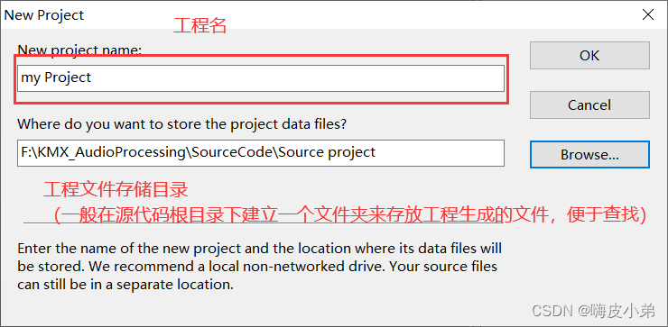
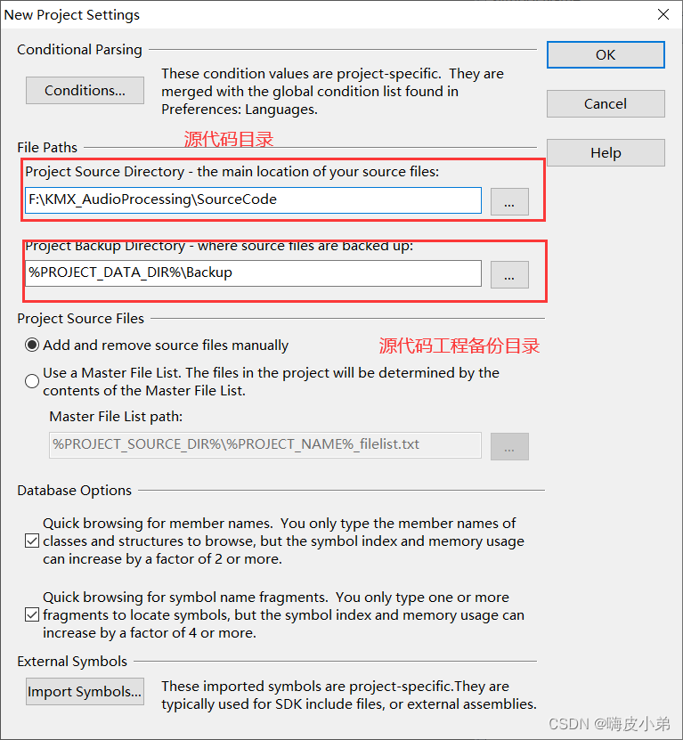
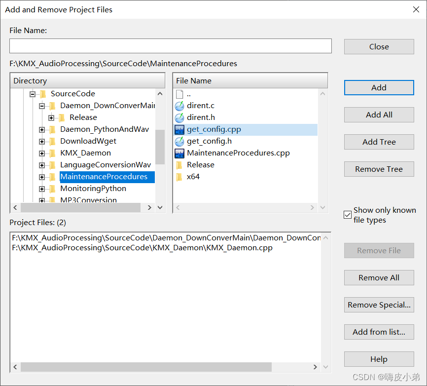

# Source insight软件使用

[Source insight 工具安装及使用方法-CSDN博客](https://blog.csdn.net/YAOHAIPI/article/details/125191451)

#### 3.1 添加工程

完成后点击close即可

3.2 使用技巧
1、将添加的代码进行同步，生成阅读代码的索引和辅助文件，方便对源代码进行阅读;点击Project–> synchronization *file,*会弹出下图框图:

2、选择语言和后缀名的文件,点击Options–>File type Options,弹出下图框图

3、选中字符，相同字符高亮，点击Options–>File type Options,弹出下图框图，标注项选上：

效果如下：

4、显示调用关系

当选择某个函数时，显示函数调用流程，选择某个函数 -> 右键 -> Show in Relation Window，如下图所示。

5、全局查找

6、解决中文乱码问题

单个文件：File -> Reload Enconding…

所有文件：Options > Preferences >File标签。

