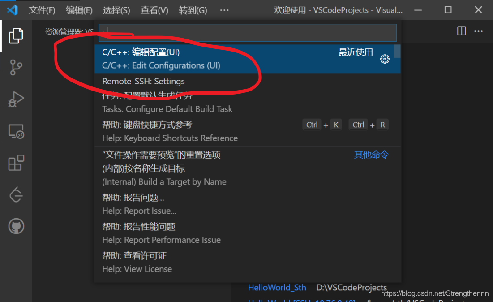
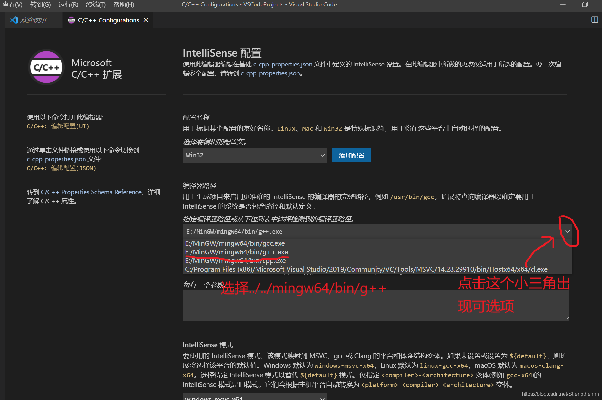
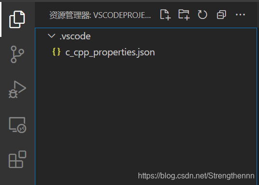
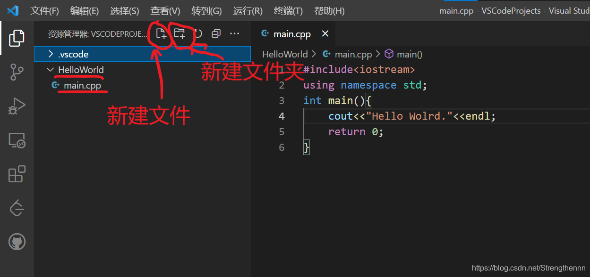
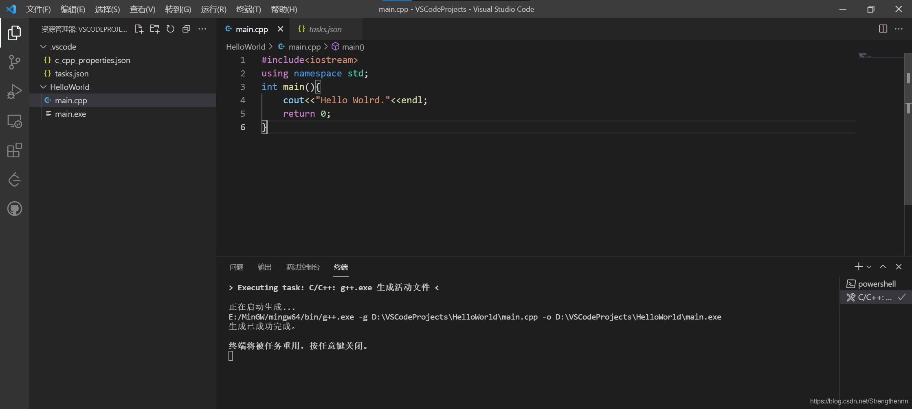
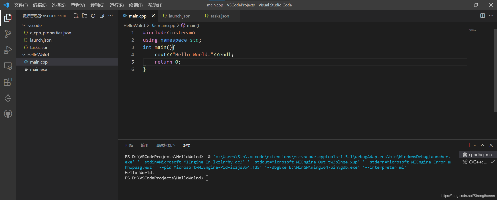

主要是配置两个和文件

参考：[[VSCode\] VSCode使用C++运行HelloWorld_vscode c++ helloworld-CSDN博客](https://blog.csdn.net/strengthennn/article/details/119702982)

## 一、对于VS Code的介绍

首先需要明确的一点是VSCode并不是一个标准意义上的IDE(Integrated Development Environment，集成开发环境)，VSCode更像是一个功能强大的编辑器。
因此与VS、Pycharm等针对特定语言或某类语言的IDE不同，使用VSCode进行编程时需要手动设置一些配置文件。

下面简要介绍如何配置VS Code运行C++ HelloWorld程序。

## 二、需要预先知道的知识&准备的工具

1.任何一个c/c++语言的程序都需要使用编译器对源代码文件(.c/.cpp)进行编译，产生可执行文件(在windows下可执行文件 的后缀为.exe)；
2.由于VS Code只是一个文本编辑器，因此需要另外下载c/c++的编译器。在windows上常用的有MinGW、msvs等。我建议使用MinGW，windows下安装MinGW的教程参考：https://www.cnblogs.com/LIJIH/p/12533926.html；

## 三、使用VS Code运行HelloWorld

如果读者英语水平尚可，强烈建议参考VS Code官网文档，链接如下：https://code.visualstudio.com/docs/cpp/introvideos-cpp
本文内容亦是参考该链接。

1.**安装MinGW**
下载安装MinGW，设置好环境变量，在 命令提示符下输入`g++ -v`出现g++的版本信息即视为成功，具体参考：https://www.cnblogs.com/LIJIH/p/12533926.html）；

2.**安装VS Code**
下载安装VS Code。打开VS Code，打开左侧边栏 扩展 栏目，搜索C++下载 运行C/C++代码的插件C/C++（可以下载各种好用的插件）。如图所示：


3.**配置VS Code**
选择 文件 --> 打开文件夹，打开一个事先准备好用来存放c++项目的文件夹。例如此处我选择的文件夹为VSCodeProjects。点击VSCode左侧的 资源管理器 选项显示结果如下：


4. **配置C++ IntelliSence**

> 这部分对应https://code.visualstudio.com/docs/cpp/introvideos-cpp#_configure-c-intellisense中的Configure C++ IntelliSense部分；

按下ctrl+shift+p打开命令行，选择编辑C/C++:编辑配置(UI)。



在C/C++ Configurations中主要配置IntelliSense，用于VS Code对代码的自动联想、显示默认函数API注释等内容。我对配置文件的修改如下（未提及的选项即为不修改）：
(1). 编译器路径 --> 点击右边向下的箭头选择你安装时的MinGW。例如我的MinGW安装在 E:/MinGW，那么我就选择E:/MinGW/mingw64/bin/g++.exe；
(2). IntelliSence–> windows-gcc-x64；
其他选项保持默认即可。




修改完成之后，在资源管理器界面下会多出一个.vscode文件夹，里面一个c_cpp_properities.json文件。如图所示：



5.**构建C++工程(配置task.json文件)**

> 这部分对应https://code.visualstudio.com/docs/cpp/introvideos-cpp#_build-a-c-project中的Build a C++ project部分；

(1). 在 资源管理器 栏目点击 新建文件夹，新建HelloWorld文件夹用来存放程序的源文件。
(2). 在HelloWorld文件夹下新建main.cpp源代码文件，并在main.cpp中写入代码。
如下图所示：



(3). 返回到main.cpp文件然后点击上方菜单栏 终端->配置默认生成任务 选择 C/C++: g++.exe 生成活动文件(注意此处一定要返回到main.cpp文件,因此VS Code会根据当前文件的后缀自动生成task.json文件内容,如果不在编辑main.cpp文件状态操作还需要手动编辑task.json文件内容)，VS Code会自动在.vscode文件夹下生成task.json文件，task.json文件内容如下:

```cpp
{
	"version": "2.0.0",
	"tasks": [
		{
			"type": "cppbuild",
			"label": "C/C++: g++.exe 生成活动文件",
			"command": "E:/MinGW/mingw64/bin/g++.exe",
			"args": [
				"-g",
				"${file}",
				"-o",
				"${fileDirname}\\${fileBasenameNoExtension}.exe"
			],
			"options": {
				"cwd": "E:/MinGW/mingw64/bin"
			},
			"problemMatcher": [
				"$gcc"
			],
			"group": {
				"kind": "build",
				"isDefault": true
			},
			"detail": "编译器: E:/MinGW/mingw64/bin/g++.exe"
		}
	]
}
```

其中command和detail选项是前面安装的MinGW路径。
此时回到main.cpp文件，按下快捷键ctrl+shift+b，VS Code会按照task.json中配置使用g++编译器编译代码，在源代码目录下生成可执行文件，如下图所示：



注意！一定要返回打开main.cpp文件，因为VS Code在使用g++编译器编译代码时以当前打开的文件为准，即，如果不返回到main.cpp，而依旧在编辑task.json文件的状态g++编译器会把task.json文件当作源代码文件进行编译。
到这里我们已经可是使用VS Code对源代码进行编译生成.exe可执行文件，但是依旧不能方便地进行Debug，为此我们还需要配置launch.json文件，之后才能像使用其他IDE那样使用VS Code进行debug。

**6.配置launch.json文件**
点击上方菜单栏 运行->添加配置，选择C++(GDB/LLDB) -> g++ 生成和调试活动文件。VS Code自动在.vscode文件夹下生成launch.json文件，内容如下:

```c++
{
    // 使用 IntelliSense 了解相关属性。 
    // 悬停以查看现有属性的描述。
    // 欲了解更多信息，请访问: https://go.microsoft.com/fwlink/?linkid=830387
    "version": "0.2.0",
    "configurations": [
        {
            "name": "g++.exe - 生成和调试活动文件",
            "type": "cppdbg",
            "request": "launch",
            "program": "${fileDirname}\\${fileBasenameNoExtension}.exe",
            "args": [],
            "stopAtEntry": false,
            "cwd": "E:/MinGW/mingw64/bin",
            "environment": [],
            "externalConsole": false,
            "MIMode": "gdb",
            "miDebuggerPath": "E:\\MinGW\\mingw64\\bin\\gdb.exe",
            "setupCommands": [
                {
                    "description": "为 gdb 启用整齐打印",
                    "text": "-enable-pretty-printing",
                    "ignoreFailures": true
                }
            ],
            "preLaunchTask": "C/C++: g++.exe 生成活动文件"
        }
    ]
}
```

然后依旧返回到main.cpp文件，使用快捷键F5或者点击上方菜单栏运行->运行即可运行程序。
结果如下：



可以看到最终在终端中运行输出了

```c++
Hello World.
```

## 四、注意事项

其实我还是建议读者参考官方文档，只有看完这一个页面Introductory Videos for C++（https://code.visualstudio.com/docs/cpp/introvideos-cpp#_build-a-c-project）即可使用VS Code运行c++程序了，虽然是英文但是也没有多少奇怪的单词，认真按照官方文档做下来其实也不很麻烦。