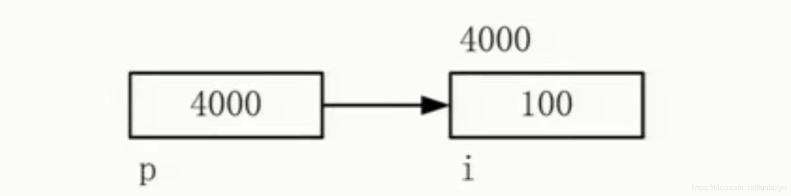

# 指针

## C中关于指针的 a、*a、&a

### 1.基本概念

#### 1.1 存储单元

> **存储单元**一般应具有存储数据和读写数据的功能，以8位(bit)二进制作为一个存储单元，也就是一个字节。
>
>  每个单元有一个地址，是一个整数编码，可以表示为二进制整数。程序中的变量和主存储器的存储单元相对应。
>
>  变量的地址对应着存储单元的地址，变量内容对应着单元所存储的数据。
>
>  存储地址一般用十六进制数表示，而每一个存储器地址中又存放着一组二进制(或十六进制)表示的数，通常称为该地址的内容。

**变量有三个要素是：变量名、变量类型、变量值。**

**变量代表了一个存储单元，其中的值是可变的，故称为变量。**

#### 1.2 C语言的变量

变量a 本质上代表一个存储单元。CPU通过该存储单元的地址访问该存储单元中的数据。所以a本来代表两个值：存储单元的地址和储单元中的数据。于是就有了二异性。

> 为了消除这种二义性，**C语言规定a表示存储单元中的数据，&a表示存储单元的地址。**

a存储单元中的数据可以是一个普通数值，也可以是另一个存储单元的地址，比如：


```undefined
a = &b;
```

语句就是将b的存储单元的地址存入a存储单元中。

> C语言规定*a代表a中存储的地址对应的存储单元中的数据，也就是访问*a就等于访问b，于是*a提供了通过a访问b中的数据的手段。

#### 1.3 操作符 *、&

***：取某地址的值（数据内容），运算符后通常跟一个地址**

**&：取某数据（变量）的地址，运算符后通常跟一个变量**

> - a表示a对应的存储单元中的数据。 
> - &a表示a对应的存储单元的地址。 
> - *a表示：首先，要求a对应的存储单元中的数据一定是另一个存储单元的地址。 
> - 于是，*a表示另一个存储单元中的数据。

当a声明的类型是int时，a中存储的是一个整数数值，通过a可以访问（读取或修改）这个数值。
当a声明的类型是int *时，a中存储的是一个存储单元的地址，而该存储单元中存储的数据是一个整数数值；

通过*a可以访问（读取或修改）这个数值。a == &*a 都是该存储单元的地址。

当a声明的类型是int *时，a中存储的是一个存储单元的地址，而该存储单元中存储的数据是另外一个存储单元的地址，另外这个存储单元中存储的是一个整数数值；**通过`**a`可以访问（读取或修改）这个数值。**

#### 1.4 指针

> C语言中，地址也称指针。
>
>  计算机中所有数据都必须放在内存中，不同类型的数据所占的字节数不一样，如int型占用4字节，char占用一个字节。
>  我们将内存中字节的编号称为地址（address）或指针（pointer），地址从0开始依次增加。

**1.4.1 指针的大小**

> 指针是一个形无符号整型,一个整数,它的大小取决于系统是16 32 还是64位的 16/8=2byte 32/8=4byte 64/8=8byte.

**1.4.2 指针指向的内容的大小**

> 指针所指向的内存块所占内存大小.32位编译环境下，char占一个字节,int占2个字节,double占4个字节,long double占8个字节(这是默认的32位编译环境下,在64位下翻倍就是了),所以一个char指针所占内存为4个字节(32位下),所指向的内存区域占1个字节.同理其它类型也是一样的。

### 2.具体解析

#### 2.1 普通变量（不带*）


```cpp
int i = 100;
```

此时，普通变量变量名i即地址中的数据（变量值）,也就是100。存在一个地址：&i（表示唯一）。

 简单理解：普通变量名=数据。


```cpp
#include <stdio.h>

void test () {
    int i = 100;
    printf("i-----%i\n",i);
    printf("&i----%p\n",&i);
}


int main(int argc, const char * argv[]) {
  
    test();
    
    return 0;
}
```

控制台输出


```undefined
i-----100
&i----0x7ffeefbff51c
```

#### 2.2 一级指针变量


```cpp
int *a = &i;
```

一级指针变量：变量名a实际所指的内容为变量i的地址，即a=&i=&(*a)=*(&a);其中*a表示通过a中的内容（i的地址）取值即i。存在两个地址：&a（唯一表示方式）和a（表示方式不唯一，如上）。

 简单理解：指针变量名=地址-------->数据。


```cpp
#include <stdio.h>

void test () {
    int i = 100;
    printf("i-----%i\n",i);
    printf("&i----%p\n",&i);
    int *a;
    printf("a-----%p\n",a);
    printf("&a----%p\n",&a);
    
    a = &i;
    printf("a-----%p\n",a);
}


int main(int argc, const char * argv[]) {
  
    test();
    
    return 0;
}
```

控制台输出


```bash
i-----100
&i----0x7ffeefbff51c
a-----0x0
&a----0x7ffeefbff510
a-----0x7ffeefbff51c
Program ended with exit code: 0
```

变量a声明后没有赋值，其值为0，将&i(也就是i的地址)赋值给a后，a保存了i的地址，这是变量a对应的存储单元存储的数据，而a本身有自己的地址即自身存储单元的地址。（这里说存储单元并不是特别准确，应该是以a地址开头的存储块）

#### 2.3 二级指针变量


```cpp
int **p = &a;
```

二级指针变量：变量名p所指内容为一级指针的地址=&a=&(*p)=*(&p）=p，该地址（&（*p））中的内容是*p，其中*p中的内容为i的地址=&i=&（**p）=**（&p）=*p
 （其中p=&a，a=&i）。

- 存在三个地址：&p（表示唯一）、p（表示不唯一）、*p（表示不唯一）。
- 简单理解：指针变量名=地址---------->地址------------>数据。
- 其中&（*）和*（&）相互抵消功能。


```cpp
#include <stdio.h>

void test () {
    int i = 100;
    printf("i-----%i\n",i);
    printf("&i----%p\n",&i);
    int *a;
    printf("a-----%p\n",a);
    printf("&a----%p\n",&a);
    
    a = &i;
    printf("a-----%p\n",a);
    
    int **p;
    p = &a;
    printf("p-----%p\n",p);
    printf("*p----%p\n",*p);
    printf("&p-----%p\n",&p);
}


int main(int argc, const char * argv[]) {
  
    test();
    
    return 0;
}
```

控制台输出


```bash
i-----100
&i----0x7ffeefbff51c
a-----0x0
&a----0x7ffeefbff510
a-----0x7ffeefbff51c
p-----0x7ffeefbff510
*p----0x7ffeefbff51c
&p-----0x7ffeefbff508
Program ended with exit code: 0
```

你可以尝试自己分析一下。

> 二级指针保存的是一级指针的地址，它的类型是指针变量，而一级指针保存的是指向数据所在的内存单元的地址，虽然都是地址，但是类型是不一样的。

### 3.指针与数组

C语言中由于指针的灵活性，导致指针能代替数组使用，或者混合使用。容易混淆的是字符数组和字符指针这两个,下面就这两个进行解析。

#### 3.1字符数组


```rust
 char str[10] = {"hello world"};
```

当编译这句代码时，编译器会将str数组中的元素从第一个元素开始逐个填入（hello world\0 ）。

 由于C语言中没有真正的字符串类型，可以通过字符数组表示字符串，因为它的元素地址是连续的。

 C语言中规定数组代表数组所在内存位置的首地址，也是 str[0]的地址，即str = &str[0];

> 让我们来看一个问题


```bash
printf("%s",str); 
```

为什么用首地址就可以输出字符串。

在C语言中字符串常量的本质表示其实是一个地址。

#### 3.2 字符指针


```cpp
char *s ;

s = "Hello";
```

为什么可以把一个字符串赋给一个指针变量。。

这不是类型不一致吗？？？

> C语言中编译器会给字符串常量分配地址，如果 "Hello", 存储在内存中的 0x3000 0x3001 0x3002 0x3003 0x3004 0x3005 .

s = "Hello" ，这是什么操作，对了，地址。

其实真正的意义是 s ="Hello" = 0x3000;

看清楚了吧 ，Hello 看作是字符串，但是编译器把它看作是地址 0x3000，即字符串常量的本质表现是代表它的第一个字符的地址。。。。。。。。。。

s = 0x3000

那么 %s ，它的原理其实也是通过字符串首地址输出字符串，printf("%s ", s);   传给它的其实是s所保存的字符串的地址。。。

字符数组：


```rust
char  str[10] = "hello"；
```

前面已经说了，str = &str[0] ， 也等于 "hello"的首地址。。

所以printf("%s",str); 本质也是 printf("%s", 地址");

#### 3.3 char * 与 char a[];


```cpp
char *s;

char a[] ;
```

- 前面说到 a代表字符串的首地址，而s这个指针也保存字符串的地址（其实首地址），即第一个字符的地址，这个地址单元中的数据是一个字符，
- 这也与 s 所指向的 char 一致。
- 因此可以 s = a;
- 但是不能 a = s;
- C语言中数组名可以复制给指针表示地址， 但是却不能赋给给数组名，它是一个常量类型，所以不能修改。。

#### 3.4 char **  与char  * a[]


```cpp
char *a [] ;
```

- 由于[] 的优先级高于* 所以a先和 []结合，他还是一个数组，数组中的元素才是char * ，前面讲到char * 是一个变量，保存的地址。。
- 所以 char *a[ ] = {"China","French","America","German"}；
- 同过这句可以看到， 数组中的元素是字符串，那么sizeof(a) 是多少呢，有人会想到是五个单词的占内存中的全部字节数 6+7+8+7 = 28；
- 但是其实sizeof(a) = 16；
- 为什么，前面已经说到， 字符串常量的本质是地址，a 数组中的元素为char * 指针，指针变量占四个字节（64bit编译器为8个字节），那么四个元素就是16个字节了

**3.4.1 易错的char ****


```cpp
 char **s = "hello world";
```

- s的类型是 char ** 而 "hello world "的类型是 char *
- 虽然都是地址，但是指向的类型不一样，因此，不能这样用。从其本质来分析，"hello world",代表一个地址，比如0x003001,这个地址中的内容是 'h',为 char 型，而 s 也保存一个地址 ，这个地址中的内容(*s) 是char *　，是一个指针类型，所以两者类型是不一样的。

**3.4.2 char **崩溃**


```cpp
char  **s;
*s = "hello world";
```

上面的代码貌似是合理的，编译也没有问题，但是 printf("%s",*s),就会崩溃

why??

咱来慢慢推敲一下。。

printf("%s",*s); 时，首先得有s 保存的地址，再在这个地址中找到 char *的地址，即*s;

举例：

s = 0x1000;

在0x1000所在的内存单元中保存了"hello world"的地址 0x003001 ， *s = 0x003001;

这样printf("%s",*s);

这样会先找到 0x1000,然后找到0x003001;

如果直接 char **s;

*s = "hello world";

s 变量中保存的是一个无效随机不可用的地址， 谁也不知道它指向哪里。*s 操作会崩溃。。

所以用 char **s 时，要给它分配一个内存地址。


```cpp
char  **s ;
s = (char **) malloc(sizeof(char**));
*s =  "hello world";
```

这样 s 给分配了了一个可用的地址，比如 s = 0x412f;

然后在 0x412f所在的内存中的位置，保存 "hello world"的值。

------

END

作者：Robinone
链接：https://www.jianshu.com/p/fe0d7ac36988
来源：简书
著作权归作者所有。商业转载请联系作者获得授权，非商业转载请注明出处。

## 指针的定义与使用

​        指针是高级编程语言中非常重要的概念，在高级语言的编程中发挥着非常重要的作用，它能使得不同区域的代码可以轻易的共享内存数据。指针使得一些复杂的链接性的数据结构的构建成为可能，有些操作必须使用指针，比如申请堆内存，还有C++或者C语言中函数的调用中*值传递都是按值传递的*，如果在函数中修改被传递的对象，就必须通过这个对象指针来完成。**指针就是内存地址**，指针变量就是用来存放内存地址的变量，不同类型的指针变量所占用的存储单元长度是相同的，而存放数据的变量因为数据类型不同，因此所占的存储空间长度也不同。使用指针不仅可以对数据本身，也可以对存储数据变量的地址进行操作。

### 1、指针的引入

**函数的缺陷：**

一个函数只能返回一个值，就算我们在函数里面写多了return语句，但是只要执行任何一条return语句，整个函数调用就结束了。

数组可以帮助我们返回多个值，但是数组是相同数据类型的结合，对于不同数据类型则不能使用数组。

使用指针可以有效解决这个问题，使用指针我们想反回几个值就能返回几个值，想返回什么类型就可以返回什么类型的值。在程序设计过程中，存入数据还是取出数据都需要与内存单元打交道，计算机通过地址编码来表示内存单元。指针类型就是为了处理计算机地址数据的，计算机将内存划分为若干个存储空间大小的单元，每个单元大小就是一个字节，即计算机将内存换分为一个一个的字节，然后为每一个字节分配唯一的编码，这个编码即为这个字节的地址。指针就是用来表示这些地址的，即指针型数据不是什么字符型数据，而存的是我们内存中的地址编码。指针可以提高程序的效率，更重要的是能使一个函数访问另一个函数的局部变量，指针是两个函数进行数据交换必不可少的工具。

**地址及指针的概念：**

程序中的数据（变量，数组等）对象总是存放在内存中，在生命期内这些对象占据一定的内存空间，有确定的存储位置，实际上，*每个内存单元都有一个地址，即以字节为单位连续编码。编译器将程序中的对象名转换成机器指令识别的地址，通过地址来存储对象值。*

```cpp
int i;   double   f;
```

计算机为int 类型数据分配4个字节，为double 类型分配8个字节。按对象名称存取对象的方式称为对象直接访问，如：i=100;   f=3.14;   通过对象地址存取对象的方式成为指针间接访问


如图，这里有一个名为4000的存储空间它放的不是数值，而是  i  这个变量的地址，i  占有四个字节每个字节都有一个地址，这个变量的地址其实就是第一个字节的地址，在这里  i  的地址指就是他第一个字节的地址，假设第一个地址是4000，这里有一个p，先不管他是个啥东西，他占了一段存储空间，他里面放的就是  i  的地址，现在我们要访问  i  但是我们不直接访问，不出现  i  的名字，而是通过找到 p 得到了p里面放的 i 的地址以后就能间接的去访问 i ,就是说我们不是直接访问这个地址的，而是通过 P 这个量去访问 i  的值，这样的访问方式就叫做**指针间接访问**。即通过对象的地址来存储对象的方式称为指针间接访问。

现在我们来举个例子详细了解一下指针到底是一个什么东东

        一个快递员送快递，如果送的是一个老顾客，那么快递员可以直接跑到顾客的办公地点，将快递交给她就行了，这就是直接访问。但是如果现在快递员拿到了一个不认识的人的快递他是一个新顾客，那么快递员跑到他的办公地点，办公地点有很多人，他也分不清谁是谁，于是快递员找到了这里的一个保安问“张三是谁”保安就会给他指出张三就是这个人。然后快递员才能把快递送到顾客手上。此时这个中间来指出张三的人（保安）就是起了指针的作用，快递员无法直接找到张三，因此他只有通过保安才能给他指出张三是谁，这就叫做间接访问。

### 2、指针的定义形式方法及其含义

c++将专门用来存放对象地址的变量叫做指针变量，下面是指针变量定义形式：

```cpp
指针类型* 指针变量名；
例如：
int* p, i;	//定义指针变量p,i为整形变量
p = &i;		//指针变量p指向i
把 i 的地址放到p
```



i  里放的是100这个数，他的地址是4000，p里面放的就是i 的地址,然后就将p 指向i，他俩的关系即为p指向i,


```cpp
假定指针变量p 的值是4000，三种写法：
char* p;
int* p;
double* p;
指针的类型其实就是它所指向的对象的类型
```

**指针的类型：**

​     **指针的类型表明的就是他所指向的对象的类型**，把p定义为char类型，即用char类型的指针P来间接访问它指向的对象时，我们间接引用的是一个字节的空间，假设p放的是4000，则系统会默认p指向的是4000这一个字节里面的内容，若将p定义成整形那么意味着我们用间接引用的方式来用指针指向对象的时候，系统就会认为你的指针占4个字节这个对象就是4000，4001, 4002, 4003 这四个字节共同组成这个对象，若定义为double类型，那么系统就会认为他指向的对象时8个字节的即4000~~4007这八个字节都认为是P所指向的对象。**这就是指针类型的含义，指针的类型应该和他指向的对象的类型一致，即整形指针应该指向整形变量，实型指针指向实型的变量。**

### 3、通过指针间接访问

通过间接引用运算  *   可以访问指针所指向的对象或者内存单元，即在指针前面加上一个 * 就表明指针所引用的东西

```cpp
int a, * p = &a;
a = 100;//直接访问a(对象直接访问）
*p = 100;//*p就是a,间接访问a(指针间接访问）
*p = *p + 1;//等价于a=a+1
```

```cpp
int a, b, * p1 = &a, * p2;

&*p1 的含义：&和*都是自右向左运算符，因此先看p1是指针，*p1即为p1指向的对象，
因此*p1等价于a,因此a 的前面加一个&,表示的就是 a 的地址
因此：&*p1 ,p1 ,&a 三者等价
*&a 的含义：a的地址前加*表示的就是a本身，指针就是用来放地址的，地址前面加*表示的就是这个对象
因此： *&a ,a ,*p 三者等价
```

```cpp
int main()
{
	int i = 100, j = 200;
	int* p1, * p2;
	p1 = &i, p2 = &j;//p1指向i,p2指向j
	*p1 = *p1 + 1;//等价于i=i+1
	p1 = p2;//将p2的值赋给p1,则p1指向j
	*p1 = *p1 + 1;//等价于j=j+1
	return 0;
}
```

### 4、指针的初始化

可以在定义指针时对它进行初始化。

```cpp
指针类型* 指针变量名 = 地址初值，......

int a;
int* p = &a;//p的初值为变量a 的地址
int b, * p1 = &b;//p1初始化是变量b已有地址值
```

对指针进行赋值只能使用以下四种类型的值：（1）空指针（2）类型匹配的对象的地址（3）同类型的另一个有效指针（4）另一对象之后的下一地址。

**4.1 空指针**
空指针（null pointer）不指向任何对象。

（1）赋值为空指针
有以下几种方法可以将指针赋值为空指针。

```cpp
int *p1 = nullptr;
int *p2 = 0;
int *p3 = NULL;
```

其中，nullptr是C++11新标准刚刚引入的一种方法。

（2）不能赋值为整形变量，但是可以赋值为整形常量
把整形变量直接赋给指针是错误的操作，如

```cpp
int zero = 0;
int *p1 = zero;
```

如果将zero声明为常量值，则可以用其对指针进行赋值：

```cpp
const int zero = 0;
int *p1 = zero;
```

（3）未定义的指针
如果只是声明了一个int指针，而未对其进行定义，如

```cpp
int *p4;
```

则此时该指针的值是0xCCCCCCCC，如图所示。

 

**4.2 类型匹配的对象的地址**
可以将指针赋值为其类型匹配的对象的地址。

```cpp
int one = 1;
int *p5 = &one;
```

从下图中可以看到，此时p5的值是0x005CFB98，而0x005CFB98的内存中保存的值是4个字节的int类型的数据，其值为1。

 

**4.3 同类型的另一个有效指针**
可以将指针赋值为同一类型的另一个有效指针。

```cpp
int one = 1;
int *p5 = &one;
int *p6 = p5;
```

此时，可以从图2-3中看到，p6的值与p5的值相同，都是0x005CFB98。

 

**4.4 另一对象之后的下一地址**
还可以将指针赋值为同类型对象的下一个地址。

```cpp
int *p7 = p5+1;
```

从图2-4中可以看到，p7的值是0x005CFB9C，也就是p5的值0x005CFB98加上4个字节。

 


### 5、指针运算

指针运算都是作用在连续存储空间上才有意义。

（1）指针加减整数运算

```cpp
int x[10], n = 3, * p = &x[5];
p + 1		//指向内存空间中x[5]后面的第1个int 型存储单元
p + n		//--------------------------n(3)个
p - 1		//-------------------前面-----1个
p - n		//
```

（2）指针变量自增自减运算

```cpp
int x[10], * p = &x[5];
p++		//p指向x[5]后面的第1个int型内存单元
++p		//-----------------1--------------
p--		//p指向x[5]前面的第1个int型内存单元
--p		//--------------------------------
```

(3)两个指针相减运算
设p1, p2是相同类型的两个指针，则p2 - p1的结果是两支针之间对象的个数，如果p2指针地址大于p1则结果为正，否则为负

```cpp
int x[5], * p1 = &x[0], * p2 = &x[4];
int n;
n = p2 - p1;//n 的值为4  即为他们之间间隔的元素的个数
```

运算方法：（p2储存的地址编码-p1储存的地址编码）/4  若是double类型则除以8  char类型除以1

（4）指针的运算关系
设p1、p2是同一个指向类型的两个指针，则p1和p2可以进行关系运算，用于比较这两个地址的位置关系即哪一个是靠前或者靠后的元素

```cpp
int x[4], * p1 = &x[0], * p2 = &x[4];
p2 > p1;   //表达式为真
```

### 6、指针的const限定

> 关于const这个就是一个能不能改变的问题（指针的const限定，显然是指针的指向对象不能改变，而指针变量可以改变）

（1）一个指针变量可以指向只读型对象，称为指向const对象的指针定义形式是：

```cpp
const 指向类型  *指针变量，...
```

即在指针变量前加const限定符，其含义是不允许通过指针来改变所指向的const对象的值，不能通过间接引用来改变它所指向的对象的值

```cpp
const int a = 10, b = 20;
const int* p;
p = &a;//正确 p不是只读的，把a的地址赋给p，给p赋值是允许的
p = &b;//正确，p不是只读的
*p = 42;//把42赋给p所指向的对象。错误，*p是只读的
```

（2）把一个const对象的地址赋给一个非const对象的指针是错误的，例如：

```cpp
const double pi = 3.14;
double* ptr = &pi;//错误，ptr是非const所指向的变量
const double* cptr = &pi;//正确，cptr是const指针变量
```

 (3)允许把非const对象的地址赋给指向const对象的指针，不能使用指向const对象的指针修改指向对象，然而如果该指针指向的是一个非const对象，可以用其他方法修改其所指向的对象

```cpp
const double pi = 3.14;
const double* cptrf = &pi;//正确
double f = 3.14;//f是double类型（非const类型）
cptrf = &f;//正确，允许将f的地址赋给cptrf
f = 1.68;//正确，允许修改f的值
*cptrf = 10.3;//错误,不能通过引用cptrf修改f的值
```

 (4)实际编程过程中，指向const的指针常用作函数的形参，以此确保传递给函数的参数对象在函数中不能被修改(**编程技巧**)

```cpp
void fun(const int* p)
{
	...
}

int main()
{
	int a;
	fun(&a);
}
```

指针作为函数的形参，在主函数中，我们定义整形变量a然后将a的地址传递给了子函数，对于子函数来说，他的形参就是用const修饰过 的整型变量p指向主函数里a这个变量。这样的一系列操作就使得我们不能在子函数中通过p间接引用a 来改变a 的值，因为a 是用const修饰过的。

### 7、const指针

> 关于const这个就是一个能不能改变的问题（指针变量不能改变）

一个指针变量可以是只读的，成为const指针它的定义形式：

```cpp
指针类型* const 指针变量, ...;
```

注意观察将const放在变量名的前面，与上面的形式不同，

```cpp
int a = 10, b = 20;
int* const pc = &a;//pc是const指针
pc = &b;//错误pc 是只读的
pc = pc;//错误pc是只读的
pc++;//错误pc是只读的
*pc = 100;//正确，a被修改
```

pc是指向int型对象的const指针

不能使pc再被赋值指向其他对象，任何企图给const指针赋值的操作都会导致编译错误

但是可以通过pc间接引用修改该对象的值


## 一维数组与指针

### 1、数组的首地址

数组有若干个元素组成，每个元素都有相应的地址，通过取地址运算符&可以得到每个元素的地址，数组的地址就是这一整块存储空间中，第一个元素的地址即a[0]

```cpp
int a[10];
int* p = &a[0];//定义指向一维数组元素的指针,用a数组的地址来初始化p,称p指向a
p = &a[5];//指向a[5] 重新给p赋值，指针数组元素的地址跟取变量的地址是一样的效果，
```

c++中规定数组名既代表数组本身，又代表整个数组的地址，还是数组首元素的地址值即：与a第0个元素的地址& a[0]相同
例如下面两个语句是等价的：

```cpp
p = a;
p = &a[0];
```

数组名是一个指针常量，因而他不能出现在左值和某些算数运算中，例如：

```cpp
int a[10], b[10], c[10];
a = b;//错误，a是常量，不能出现在左值的位置
c = a + b;//错误，a,b是地址值，不允许加法运算
a++;//错误，a 是常量不能使用++运算
```

> 常量与变量
>
> 常量：
>
> 变量：

### 2、指向一维数组的指针变量

定义指向一维数组元素的指针变量时，指向类型应该与数组元素类型一致

```cpp
int a[10], * p1;
double f[10], * p2;
p1 = a;//正确
p2 = f;//正确
p1 = f;//错误，指向类型不同，不能赋值。
```

### 3、通过指针访问一维数组

由于数组的元素地址是规律性增加的，根据指针运算规律，可以利用指针及其运算来访问数组元素

```cpp
int* p, a[10] = { 1,2,3,4,5,6,7,8,9,0 };
p = a;//指向数组a,其实就是让p指向了a[0]
p++;//指向了下一个数组元素即a[1]
```


根据上面的图与上面的代码，我们设：

a是一个一维数组，p是指针变量，且p=a；下面我们来访问一个数组元素 a[i]；

（1）数组下标法：a[i];

（2）指针下标法：p[i];  p里面已经放了数组的地址了，因此数组名和p 是等价的所以  **p[i]与a[i]含义相同**

（3）地址引用法：`*（a+i)`;  a表示的是下标为0 的元素的地址  (a+i) 即为a这个数组往后数第 i  个元素的地址 即第 i 个元素的地址  那么`*（a+i)`相当于地址再加一个星号表示的就是这个地址对应的存储单元，或者说对应的对像即为 a[i]这个元素

（4）指针引用法：*（p+i）；将a替换成p跟（3）含义相同

下面我们用多种方法来遍历一维数组元素：

（1）下标法：优点是程序写法直观，能直接知道访问的是第几个元素

```cpp
#include<iostream>
using namespace std;
int main()
{
	int a[4];
	for (int i = 0; i < 4; i++)
		cin >> a[i];
	for (int i = 0; i < 4; i++)
		cout << a[i] << " ";
	return 0;
}
```

> [一文弄清using namespace std；的作用[2021最新版\]_usingnamespacestd的作用-CSDN博客](https://blog.csdn.net/codebowl/article/details/118052278)

（2）通过地址间接访问数组元素

```cpp
#include<iostream>
using namespace std;
int main()
{
	int a[5],i;
	for (i = 0; i < 5; i++)
		cin >> *(a + i);
	for (i = 0; i < 5; i++)
		cout << *(a + i) << " ";
}
```

（3）通过指向数组的指针变量间接访问数组，用指针作为循环控制变量  优点是指针直接指向元素，不必每次都重新计算地址，能提高运行效率（我们用P某一个元素的时候p本身已经放了这个元素的地址，因此计算机就不用再去计算这个元素的地址，因为取一个元素的时候要先知道他的地址），将自增自减运算用于指针变量十分有效，可以使指针变量自动向前或者向后指向数组的下一个或前一个元素

```cpp
#include<iostream>
using namespace std;
int main()
{
	int a[5], * p;
	for (p = a; p < a + 5; p++)
		cin >> *p;
	for (p = a; p < a + 5; p++)
		cout << *p << " ";
}
```

指针p初值为a,即一开始指向元素a[0]，指针可以进行比较运算 p

```cpp
cin>>*p;即为间接的引用了p所指向的数组元素。
```


## 用指针来操纵字符串

可以利用一个字符型的指针来处理字符串，其中过程与通过指针访问数组元素相同，使用指针可以简化字符串的处理。

c++允许定义一个字符指针，初始化是指向一个字符常量，一般形式为：

```cpp
char* p = "C Language";
```

或者

```cpp
char* p;
p="C Language";
```

初始化时，p存储了这个字符串字符地址，而不是字符串常量本身，相当于char类型的指针指向"C Language"这个字符串的首地址，即第一个元素C的地址称p指向字符串

下面我们通过字符串指针来访问字符串

```cpp
char str[] = "C Language", * p = str;//p指向字符串的指针相当于p指向了str[0]
cout << p << endl;//输出：C Language  跟cout<<str<<endl；效果相同
cout << p + 2 << endl;//输出：Language 从字符L开始输出直到结束
cout << &str[7] << endl;//输出：age   从第7个元素开始输出
```

```cpp
#include<iostream>
using namespace std;
int main()
{
	char str[] = "C language", * p = str;
	cout << p << endl;
	return 0;
}
```

运行结果：


```cpp
#include<iostream>
using namespace std;
int main()
{
	char str[] = "C language";
	char* p = str;
	cout << p+2 << endl;
	return 0;
}
```


```cpp
#include<iostream>
using namespace std;
int main()
{
	char str[] = "C Language";
	char* p = str;
	cout << p << endl;
	cout << p+2 << endl;	
	cout << &str[7] << endl;
	return 0;
}
```


通过字符指针来遍历字符串

```cpp
char str[] = "C Language", * p = str;
while (*p!='\0')cout << *p++;
```

判断p指向的元素是不是字符串结束的标志`*p++` 的含义：先输出p指向的元素然后p++(后置增增，先做完其他事再自增)。
假设从str[0]开始，p指向的是C满足(*p!='\0')因此执行循环，下一个循环p指向“空格”不是字符串结束的标志，继续循环直到遇到字符串结束的标志后结束循环。
举例:

```cpp
#include<iostream>
using namespace std;
int main()
{
	char str[100], * p = str;
	cin >> str;
	while (*p)p++;
	cout << "strlen=" << p - str << endl;
	return 0;
}
```


while(*p)p++;的含义：进入循环判断逻辑值p是否为真，（非零为真，零为假）即判断p是否指向字符串结束标志（字符串结束标志符ASLL码为0）若p指向的字符不是空字符则括号内容为真执行循环p++（p指向下一个字符），否则结束循环

p-str为指针相减运算即看这两个指针中间相隔了多少个元素，这里的p已经是字符串结束标志，str表示的str[0]

注意：

指针可以指向数组，这使得数组访问多了一种方式，单指针不能代替数组存储大批量元素

```cpp
char s[100] = "Computer";
```

s是数组名不能赋值，自增自减运算

```cpp
char* p = "Computer";
```

p是一个指针，他存放的是这个字符串的首地址
p是一个指针变量，他能指向这个字符串也能指向其他东西可以进行赋值和自增自减

1、存储内容不同
2、运算方式不同
3、赋值操作不同
s一旦赋初值之后就不能再用其他字符来赋值，然而p却能重新指向其他字符

```cpp
int a = 10, * p;
int& b = a;
p = &a;
string s = "C++";
string* ps = &s;
cout << p << endl;  //输出指针p的值，a变量的首地址
cout << b << endl;  //输出b的值是10
cout << *p << endl;  //输出指针p指向的变量，即a的值10
cout << ps << endl;;  //输出指针ps的值，s变量的地址
cout << *ps << endl; //输出指针ps指向的变量的值，即“C++”
```


二维数组字符串：

```cpp
char s[6][7] = { "C++","Java","C","PHP","CSharp","Basic" };
```

内存形式


