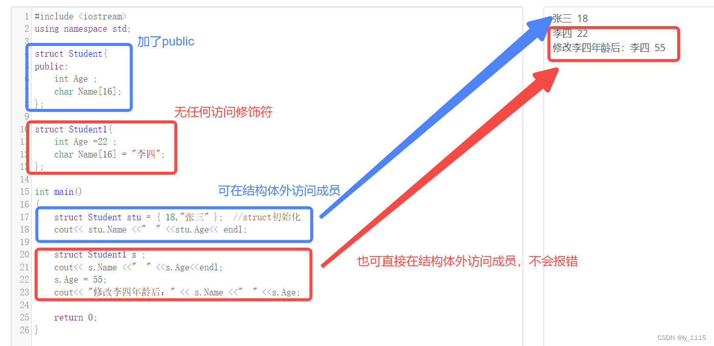
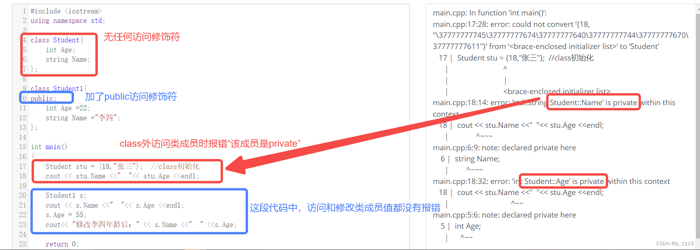
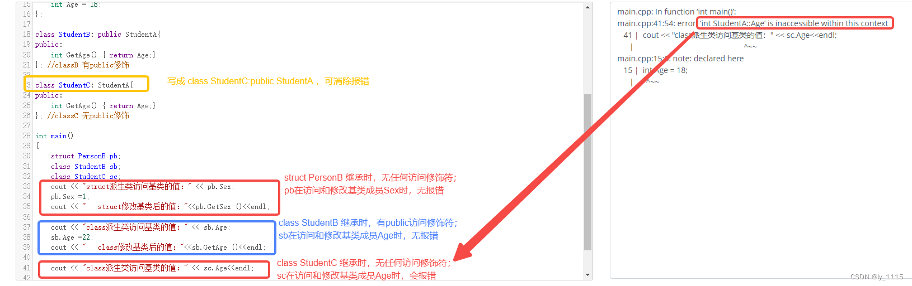
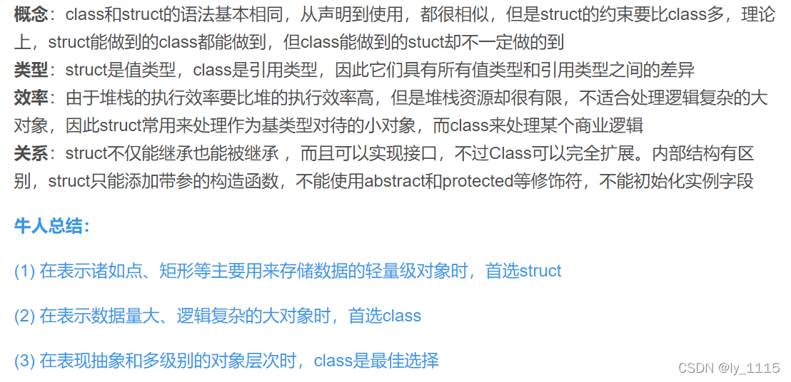
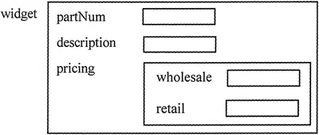
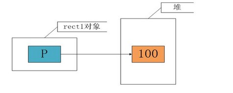
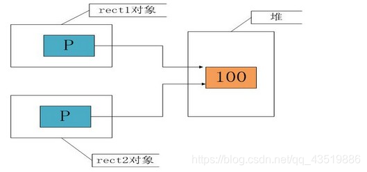
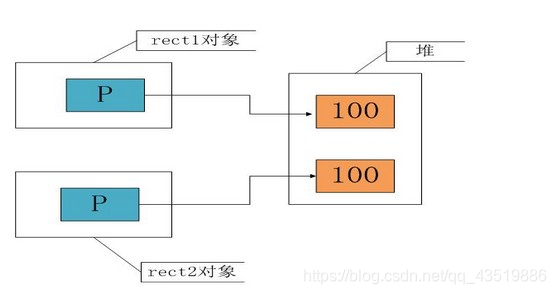

# c++类与结构体

## c++类和结构体两者区别

#### **C++中结构体（struct）**

我们知道C++中的 struct 对C中的 struct 进行了扩充，它不再是只能用来封装不同类型数据的数据结构了，而是拥有了更多的功能，例如：可以包含成员函数，**可以继承，可以实现多态**！！，这些功能与C++中的类很相似。

那么接下来我们解剖一下C++中结构体struct与类class的区别。

#### **C++中struct与class的区别**

##### 一、class和struct 本身成员的默认访问级别不同

**这是最本质的区别**，结构体的成员和成员函数在默认情况下的访问级别是公有的（public），类的成员和成员函数在默认情况下的访问级别是私有的（private）。

> 注意： 二者的访问方式都是 对象名+点（对象成员选择运算符）+访问对象成员

不用多介绍，我们直接通过下面的代码进行区分和理解：

1.struct的用法：不加任何访问限定符，struct默认访问权限是public，即成员可直接在结构体外被访用。其他用法与class类似，即对象定义时struct类型也可省略。

```cpp
#include <iostream>
using namespace std;

struct Student{
public:
	int Age ;
    char Name[16];
};  

struct Student1{
	int Age =22 ;
    char Name[16] = "李四";
}; 

int main()
{
	struct Student stu = { 18,"张三" };  //struct初始化
	cout<< stu.Name <<"  " <<stu.Age<< endl;
	

	struct Student1 s ;  
	cout<< s.Name <<"  " <<s.Age<<endl;
	s.Age = 55;
	cout<< "修改李四年龄后：" << s.Name <<"  " <<s.Age;
	
	return 0;

}
```



2.class的用法：不加任何访问限定符时，class默认访问权限是private，即类中的成员不能直接在类外被访问。若想实现在类外被访问则必须加public

```cpp
#include <iostream>
using namespace std;

class Student{
	int Age;
	string Name;
};

class Student1{
public:
	int Age =22;
	string Name ="李四";
};

int main()
{
	Student stu = {18,"张三"};  //class初始化
	cout << stu.Name <<"  "<< stu.Age <<endl;
	Student1 s;
	cout << s.Name <<"  "<< s.Age <<endl;
	s.Age = 55;
	cout<< "修改李四年龄后：" << s.Name <<"  " <<s.Age;
	
	return 0;

}
```



修复 ：在代码第4行和第5行中间加上public:,可修复报错处，得到正确结果。

##### 二、class和struct 继承类的默认访问级别不同

简单来说就是，
结构体常见的继承方式 `struct A｛ char a;｝; struct B:A{char b;};`，这里结构体B是A的公有继承，即基类中所有public成员在派生类中为public属性；结构体外的函数调用时可使用B.a 进行访问。

但如果将上面一句代码中struct改成class，那么类B就是A的私有继承，即基类中的所有public成员在派生类中均为private属性；类外的函数调用时无法通过B.a进行访问。这就是class与struct在继承中默认访问权限的区别，如果在类中想将类B写成A的公有继承，需要改写为 `class B：public A`。

通过下面的代码可以帮助更好的理解：

```cpp
#include <iostream>
using namespace std;

class Student
{
public:
	int Age = 18; 
};

class A: Student{  //非"class A: public Student"即表示私有继承
public:
	int GetAge() { return Age;}  //派生类可以访问基类的public成员
};

int main()
{
	class Student s;
	class A a;
	cout <#include <iostream>
using namespace std;

struct PersonA{
	int Sex = 0;
};
struct PersonB:PersonA{
	int GetSex() { return Sex;}  //该派生类预期可以访问基类的public成员
};
	

class StudentA
{
public:
	int Age = 18; 
};  

class StudentB: public StudentA{  
public:
	int GetAge() { return Age;}  
}; //classB 有public修饰

class StudentC: StudentA{  
public:
	int GetAge() { return Age;}  
}; //classC 无public修饰

int main()
{
	struct PersonB pb;
	class StudentB sb;
	class StudentC sc;
	cout << "struct派生类访问基类的值：" << pb.Sex;
	pb.Sex =1;
	cout << "   struct修改基类后的值："<<pb.GetSex ()<<endl;
	
	cout << "class派生类访问基类的值：" << sb.Age;
	sb.Age =22;
	cout << "   class修改基类后的值："<<sb.GetAge ()<<endl;
	
	cout << "class派生类访问基类的值：" << sc.Age<<endl;

	return 0;

}
```



> 修复 ：把代码第23行改成class StudentC:public StudentA:,可修复报错处，得到正确结果。
>

从上面的代码来看，二者说到底也只是默认访问权限的区别。**且继承方式的默认访问权限与基类无关，而是由继承中的子类决定的**。

也就是说struct可以继承class，同样class也可以继承struct，我们默认的继承访问权限要看子类到底是struct还是class。下面这段代码简单举例：

```cpp
struct A ｛｝；class B｛｝；       //private 继承
class A ｛｝；struct B｛｝；        //public 继承
```

虽然这里struct 与class 的用法差不多，**但是struct 仍然是一种数据结构的实现体，而class 则是一个对象的实现体**。所以习惯struct 体内的变量叫做数据，class 内的变量叫做成员。

> 这里我想说明一点，即使struct 与class 可以依靠默认的访问权限进行区分，但是我们仍然应该养成在自己的程序里写明的习惯，方便别人的阅读。
>

##### 三、赋值方式区别

给一个结构赋值：

```cpp
struct A{char c1; int n2; float db3;};A a = {'a',1,3.14};
```


这样可以直接给结构体赋值，没有任何错误。但是要是将struct换成class就不行了。为什么呢？

其实就是因为class中有默认的构造函数、析构函数等。可以试着在上面结构中添加一个构造函数，会发现，上面的赋值语句失败了！所以真理很明确了！

我们平时使用{}来对结构赋值，是一个初始化列表形式进行初始化，这样简单的初始化只能用在简单的数据结构上，如果加上构造函数，那么struct会表现出一种对象的特性，因此再使用这种方式赋值就会失效！

也就是说当我们在一个结构中加入构造函数后，结构体的内部结构会发生变化；但加入一个普通函数，结构体内部结构依旧不变；因此可以理解为普通函数是一种对数据结构的算法，并不会打破原本数据的特性！

##### 四、总结



### c++结构体

##### 一、定义与声明

> 各种定义结构体的形式

###### 1. 先定义结构体类型再单独进行变量定义

```cpp
struct Student
{
    int Code;
    char Name[20];
    char Sex;
    int Age;
};
//就是定义一个Stu的结构体
struct Student Stu;			   。
//定义一个数组类型的结构体。所谓结构体数组，是指数组中的每个元素都是一个结构体。在实际应用中，C语言结构体数组常被用来表示一个拥有相同数据结构的群体，比如一个班的学生、一个车间的职工等。
struct Student StuArray[10];
//定义一个指针类型的结构体。当一个指针变量指向结构体时，我们就称它为结构体指针。
struct Student *pStru;			
```

> 关于指针类型的结构体详情：[C语言结构体指针（指向结构体的指针）详解 (biancheng.net)](https://c.biancheng.net/view/2033.html)

> **结构体指针优势**：结构体变量名代表的是整个集合本身，作为函数参数时传递的整个集合，也就是所有成员，而不是像数组一样被编译器转换成一个指针。如果结构体成员较多，尤其是成员为数组时，传送的时间和空间开销会很大，影响程序的运行效率。所以最好的办法就是使用结构体指针，**这时由实参传向形参的只是一个地址，非常快速**。

###### 2. 紧跟在结构体类型说明之后进行定义

```cpp
struct Student
{
    int Code;
    char Name[20];
    char Sex;
    int Age;
}Stu,StuArray[10],*pStu;
```

这种情况时，后面还可以再定义结构体变量。

###### 3. 在说明一个无名结构体变量的同时直接进行定义

```cpp
struct
{
    int Code;
    char Name[20];
    char Sex;
    int Age;
}Stu,Stu[10],*pStu;
```

**这种情况下，之后不能再定义其他变量。**

###### 4. 使用typedef说明一个结构体变量之后再用新类名来定义变量

```cpp

typedef struct
{
    int Code;
    char Name[20];
    char Sex;
    int Age;
}student;
Student Stu,Stu[10],*pStu;
```

Student是一个具体的结构体类型，唯一标识。这里不用再加struct

###### 5. 使用new动态创建结构体变量

使用new动态创建结构体变量时，必须是结构体指针类型。访问时，普通结构体变量使用使用成员变量访问符`"."`，指针类型的结构体变量使用的成员变量访问符为`"->"`。

- 注意：动态创建结构体变量使用后勿忘delete。


```cpp
#include <iostream>

using namespace std;

struct Student
{
    int Code;
    char Name[20];
    char Sex;
    int Age;
}Stu,StuArray[10],*pStu;

int main(){

    Student *s = new Student();  // 或者Student *s = new Student;
    s->Code = 1;
    cout<<s->Code;

    delete s;
    return 0;
}
```

##### 二、结构体构造函数

**三种结构体初始化方法：**

- 1.利用结构体自带的默认构造函数
- 2.利用带参数的构造函数
- 3.利用默认无参的构造函数

**要点：**什么都不写就是使用的结构体自带的默认构造函数，如果自己重写了带参数的构造函数，初始化结构体时如果不传入参数会出现错误。在建立结构体数组时,如果只写了带参数的构造函数将会出现数组无法初始化的错误！！！下面是一个比较安全的带构造的结构体示例

```cpp
struct node{
    int data;
    string str;
    char x;
    //注意构造函数最后这里没有分号哦！
  node() :x(), str(), data(){} //无参数的构造函数数组初始化时调用
  node(int a, string b, char c) :data(a), str(b), x(c){}//有参构造
};
```

```cpp
//结构体数组声明和定义
struct node{
    int data;
    string str;
    char x;
    //注意构造函数最后这里没有分号哦！
  node() :x(), str(), data(){} //无参数的构造函数数组初始化时调用
  node(int a, string b, char c) :data(a), str(b), x(c){}//初始化列表进行有参构造
}N[10];
```

##### 三、结构体嵌套

正如一个类的对象可以嵌套在另一个类中一样，一个结构体的实例也可以嵌套在另一个结构体中。例如，来看以下声明：


```cpp
struct Costs
{
    double wholesale;
    double retail;
};

struct Item
{
    string partNum;
    string description;
    Costs pricing;
}widget;
```

Costs 结构体有两个 double 类型成员，wholesale 和 retail。Item 结构体有 3 个成员，前 2 个是 partNum 和 description，它们都是 string 对象。第 3 个是 pricing，它是一个嵌套的 Costs 结构体。如果定义了一个名为 widget的 Item 结构体，则图 3 说明了其成员。



嵌套结构体访问的方式：

```bash
widget.partnum = "123A";
widget.description = "iron widget";
widget.pricing.wholesale = 100.0;
widget.pricing.retail = 150.0;
```

##### 四、结构体赋值与访问

- **赋值**
   初始化结构体变量成员的最简单的方法是使用初始化列表。初始化列表是用于初始化一组内存位置的值列表。列表中的项目用逗号分隔并用大括号括起来。


```cpp
struct Date
{
    int day, month, year;
};
```

该声明定义 birthday 是一个 Date 结构体的变量，大括号内的值按顺序分配给其成员。所以 birthday 的数据成员已初始化，如图 2 所示。


也可以仅初始化结构体变量的部分成员。例如，如果仅知道要存储的生日是8月23日， 但不知道年份，则可以按以下方式定义和初始化变量：


```jsx
Date birthday = {23,8};
```

这里只有 day 和 month 成员被初始化，year 成员未初始化。但是，如果某个结构成员未被初始化，则所有跟在它后面的成员都需要保留为未初始化。使用初始化列表时，C++不提供跳过成员的方法。以下语句试图跳过 month 成员的初始化。这是不合法的。


```jsx
Date birthday = {23,1983}; //非法
```

还有一点很重要，不能在结构体声明中初始化结构体成员，因为结构体声明只是创建一个新的数据类型，还不存在这种类型的变量。例如，以下声明是非法的：


```cpp
  //非法结构体声明
struct Date
{
    int day = 23,
    month = 8,
    year = 1983;
}；
```

因为结构体声明只声明一个结构体“看起来是什么样子的”，所以不会在内存中创建成员变量。只有通过定义该结构体类型的变量来实例化结构体，才有地方存储初始值。

- **访问**

定义结构体：


```cpp
struct MyTree{
    MyTree*left;
    MyTree*right;
    int val;
    MyTree(){}
    MyTree(int val):left(NULL),right(NULL),val(val){}
};
```

一般结构体变量的访问方式：


```cpp
int main(){

    MyTree t;
    t.val = 1;
    cout<<t.val;

    return 0;
}
```

可见，结构体中的变量，可以直接通过`"."`操作符来访问。

而对于结构体指针而言：必须通过`"->"`符号来访问指针所指结构体的变量。


```cpp
int main(){

    MyTree *t1 = new MyTree(1);
    MyTree *t2 ;
    t2->val = 2;
    cout<<t1->val<<" "<<t2->val;  //输出：1 2
    t2.val = 3;  //error: request for member 'val' in 't2', whitch is of pointer type 'MyTree*' (maybe you meant to use '->' ?)
    cout<<t2.val;  //error: request for member 'val' in 't2', which is of pointer type 'MyTree*' (maybe you mean to use '->' ?
    return 0;
}
```

### c++类

#### 一、类的结构

1、类使用关键词class进行定义，四要素：类名、数据成员、函数成员、访问限定符。

2、访问限定符有：private----私有，public------公有，protected------保护

> 类的数据类型在默认情况下是private，结构体的数据在默认情况下是public

3、**成员函数的定义**方式有两种：1）直接在类的内部进行定义 2）在类的内部进行函数的声明，在类的外部进行函数的定义

> 在外部进行定义时需要使用域作用符 **::** ，格式为
>
> 返回值类型 类名::函数名(参数);

#### 二、类的定义与访问

1、类的定义与普通变量的定义方式相同，即“类名 对象名”，一个对象所占空间大小是类中每一个数据成员所占内存大小之和。

2、类中成员的访问使用" **.** "运算符（点运算符）。当对象为一个指针时，访问时要使用“**->**”运算符。

3、两个对象之间可以使用“=”进赋值操作。

> 仅仅使用“=”赋值时需要注意深浅拷贝的问题
>
> 深浅拷贝：
>
> [图文并茂，一分钟看懂的C++深浅拷贝_c++深拷贝和浅拷贝图解-CSDN博客](https://blog.csdn.net/duchenlong/article/details/105687389)
>
> [C++之浅拷贝和深拷贝 - 知乎 (zhihu.com)](https://zhuanlan.zhihu.com/p/271332700)

#### 三、静态成员

**（一）静态数据成员**

1、静态数据成员使用关键字static，它需要在类内声明，在类外定义或初始化（默认为0），**在类创建时没有为静态数据成员分配内存空间，所以需要在类外进行定义。**

```cpp
class Apple
{
    int i;
    static int n;  //static关键字+变量类型+变量名
};
int Apple::n=1;  //类外进行定义或初始化，需要使用域作用符
```

2、静态数据成员不属于类，如果需要更改静态数据成员，则需要调动静态函数成员

**（二）静态函数成员**

[C++ static静态成员函数（入门必读） (biancheng.net)](https://c.biancheng.net/view/m0wxyzl.html#:~:text=静态成员函数不依赖于类的实例，而是直接与类名绑定。 因此，静态成员函数通过类名直接调用，而不是通过对象。 静态成员函数提供了一种与类而非对象相关联的方法，这使得它在设计模式（如单例和工厂模式）、对静态成员变量的操作（访问和修改）中非常有用。 在,C%2B%2B 中，在普通成员函数的基础上，用 static 关键字修饰它，这样的成员函数被称为静态成员函数。)

1、静态函数成员与静态数据成员一样不属于类。**只能访问静态数据成员**。

2、静态函数成员的外部访问：

1）在对象声明之前，静态函数调用需要用到类名和域作用符

```
类名::静态成员函数
```

2）在对象声明之后，可以直接通过对象访问静态函数

```
对象名.静态函数
对象指针->静态函数
```

#### 四、构造函数与析构函数

**（一）构造函数**

构造函数是一种特殊的成员函数，与其他成员函数不同，不需要用户来调用它，而是在建立对象时自动执行。构造函数的功能是由用户定义的，用户根据初始化的要求设计函数体和函数参数，可以是一个，也可以是多个，可以把构造函数理解为重载的一种（函数名相同，不会返回任何类型，也不可以是void类型，参数类型个数可不同）。

```CPP
class Animal
{
private:
	string name;
public:
	Animal();//默认构造函数
	Animal(string n);//也可以自定义构造函数
};

Animal::Animal()
{
	//什么都不做
}
Animal::Animal(string n)
{
	this->name = n;
}

int main()
{
	//第一种实例化对象的方法
	Animal * a = new Animal(); //将调用默认构造函数
	Animal * b = new Animal("花狗"); //将调用自定义的构造函数，对name变量初始化。
	

	//第二种实例化对象的方法
	Animal c; //将调用默认构造函数 
	//注意：对于无参构造函数，不可以使用Animal c(),
	Animal c("花狗");//将调用自定义构造函数，对name变量初始化。
	return 0;

}
```


构造函数的作用就是对当前类对象起到一个初始化的作用，类对象不像我们基本类型那样，在很多时候都需要初始化一些成员变量。

```
可以看到构造函数被声明在public里面，那么可以声明在private里面吗？是可以的，只不过不能被外部实例化了，在设计模式中有一种单例模式，就是这样设计的，有兴趣的可以了解一下。
```

> C++的四个默认函数:[C++的四个默认函数（构造函数，析构函数，拷贝函数，赋值函数）_c++默认构造函数 默认析构函数 默认拷贝函数-CSDN博客](https://blog.csdn.net/Fdog_/article/details/113920661)
>
> A() //默认构造函数
> ~A() //默认[析构函数](https://so.csdn.net/so/search?q=析构函数&spm=1001.2101.3001.7020)
> A（const A&) //默认[拷贝构造函数](https://so.csdn.net/so/search?q=拷贝构造函数&spm=1001.2101.3001.7020)
> A& [operator](https://so.csdn.net/so/search?q=operator&spm=1001.2101.3001.7020) = (const A &) //默认赋值函数。

**（二）析构函数**

1、析构函数没有参数，没有返回值，且不为void。构造函数在一个类中只能有一个

```CPP
~类名();  //构造函数规则，无参无返
```

2、析构函数的调用顺序与构造函数的调用顺序相同，也就是：先创建的对象后析构，后创建的对象先析构

3、如果一个类没有析构函数，系统会自动创建一个缺省版本的析构函数。该析构函数为空函数。所以，当类中有动态内存成员时，一定要自己编写构析构函数，确保动态内存的释放。

```cpp
//释放动态内存的析构函数写法
class student
{
    private:
        char* name;
        int age;
    public:
    	student();//默认构造函数
        ~student();//默认析构函数
};
```

#### 五、拷贝构造函数（Copy Constructor）

[一文看懂C++类的拷贝构造函数所有用法（超详细！！！）_类拷贝函数怎么用-CSDN博客](https://blog.csdn.net/qq_43519886/article/details/105170209)

**一. 什么是拷贝构造函数**

转自百度定义：拷贝构造函数，又称复制构造函数，是一种特殊的构造函数，它由编译器调用来完成一些基于同一类的其他对象的构建及初始化。其形参必须是引用，但并不限制为const，一般普遍的会加上const限制。此函数经常用在函数调用时用户定义类型的值传递及返回。拷贝构造函数要调用基类的拷贝构造函数和成员函数。如果可以的话，它将用常量方式调用，另外，也可以用非常量方式调用。

对于普通类型的对象来说，它们之间的复制是很简单的，例如：

```cpp
int a = 100;
int b = a; 
```

而类对象与普通对象不同，类对象内部结构一般较为复杂，存在各种成员变量。
下面看一个类对象拷贝的简单例子。

> 引用：与指针类似 ，提高传递效率

```cpp
#include<iostream>
using namespace std;
class CExample
{
private:
    int a;
public:
    //构造函数
    CExample(int b)
    {
        a=b;
        printf("constructor is called\n");
    }
    //拷贝构造函数
    CExample(const CExample & c)//这里是引用
    {
        a=c.a;
        printf("copy constructor is called\n");
    }
    //析构函数
    ~CExample()
    {
        cout<<"destructor is called\n";
    }
    void Show()
    {
        cout<<a<<endl;
    }
};
int main()
{
    CExample A(100);
    CExample B=A;
    B.Show(); 
    return 0;
}
```

程序运行结果如下：

```cmd
constructor is called
copy constructor is called
100
destructor is called
destructor is called
```

运行程序，屏幕输出100。从以上代码的运行结果可以看出，系统为对象 B 分配了内存并完成了与对象 A 的复制过程。就类对象而言，相同类型的类对象是通过拷贝构造函数来完成整个复制过程的。

`CExample(const CExample& C)`　就是我们自定义的拷贝构造函数。可见，拷贝构造函数是一种特殊的构造函数，函数的名称必须和类名称一致，它必须的一个参数是本类型的一个引用变量。

**二. 使用条件**

在C++中，下面三种对象需要调用拷贝构造函数（有时也称“复制构造函数”）：

（1）一个对象作为函数参数，以值传递的方式传入函数体；

```cpp
void g_fun(CExample c)
{
    cout<<"g_func"<<endl;
}
int main()
{
    g_fun(A);
}
```

（2）一个对象作为函数返回值，以值传递的方式从函数返回；

```cpp
CExample g_fun()
{
    CExample temp(0);
    return temp;
}
int main()
{
    g_fun();
}
```

（3）一个对象用于给另外一个对象进行初始化（常称为赋值初始化）；

```cpp
CExample A(100);
CExample B=A;
```

如果在前两种情况不使用拷贝构造函数的时候，就会导致一个指针指向已经被删除的内存空间。对于第三种情况来说，初始化和赋值的不同含义是拷贝构造函数调用的原因。事实上，拷贝构造函数是由普通构造函数和赋值操作符共同实现的。描述拷贝构造函数和赋值运算符的异同的参考资料有很多。

**三、浅拷贝与深拷贝**

**1. 默认拷贝构造函数**
很多时候在我们都不知道拷贝构造函数的情况下，传递对象给函数参数或者函数返回对象都能很好的进行，这是因为编译器会给我们自动产生一个拷贝构造函数，这就是“默认拷贝构造函数”，这个构造函数很简单，仅仅使用“老对象”的数据成员的值对“新对象”的数据成员一一进行赋值，它一般具有以下形式：

```cpp
Rect::Rect(const Rect& r)
{
   width=r.width;
   height=r.height;
}
```

当然，以上代码不用我们编写，编译器会为我们自动生成。但是如果认为这样就可以解决对象的复制问题，那就错了，让我们来考虑以下一段代码：

```cpp
#include<iostream>
using namespace std;
class Rect
{
public:
    Rect()
    {
     count++;
    }
    ~Rect()
    {
     count--;
    }
    static int getCount()
    {
     return count;
    }
private:
    int width;
    int height;
    static int count;
};
int Rect::count=0;
int main()
{
    Rect rect1;
    cout<<"The count of Rect:"<<Rect::getCount()<<endl;
    Rect rect2(rect1);
    cout<<"The count of Rect:"<<Rect::getCount()<<endl;
    return 0;
}
```

这段代码对前面的类，加入了一个静态成员，目的是进行计数。在主函数中，首先创建对象rect1，输出此时的对象个数，然后使用rect1复制出对象rect2，再输出此时的对象个数，按照理解，此时应该有两个对象存在，但实际程序运行时，结果如下：

```cpp
The count of Rect:1
The count of Rect:1
```

此外，在销毁对象时，由于会调用销毁两个对象，类的析构函数会调用两次，此时的计数器将变为负数。

说白了，就是拷贝构造函数没有处理静态数据成员。

出现这些问题最根本就在于在复制对象时，计数器没有递增，我们重新编写拷贝构造函数，如下：

```cpp
#include<iostream>
using namespace std;
class Rect
{
public:
    Rect()
    {
        count++;
    }
    Rect(const Rect& r)
    {
        width=r.width;
        height=r.height;
        count++;
    }
    ~Rect()
    {
        count--;
    }
    static int getCount()
    {
        return count;
    }
private:
    int width;
    int height;
    static int count;
};
int Rect::count=0;
int main()
{
    Rect rect1;
    cout<<"The count of Rect:"<<Rect::getCount()<<endl;
    Rect rect2(rect1);
    cout<<"The count of Rect:"<<Rect::getCount()<<endl;
    return 0;
}
```

此时的输出与我们期望的一致，结果如下：

```cpp
The count of Rect:1
The count of Rect:2
```

**2 .浅拷贝**

所谓浅拷贝，指的是在对象复制时，只对对象中的数据成员进行简单的赋值，默认拷贝构造函数执行的也是浅拷贝。大多情况下“浅拷贝”已经能很好地工作了，但是一旦对象存在了动态成员，那么浅拷贝就会出问题了，让我们考虑如下一段代码：

```cpp
#include<iostream>
#include<assert.h>
using namespace std;
class Rect
{
public:
  Rect()
  {
   p=new int(100);
  }

  ~Rect()
  {
   assert(p!=NULL);
      delete p;
  }
private:
  int width;
  int height;
  int *p;
};
int main()
{
  Rect rect1;
  Rect rect2(rect1);
  return 0;
}
```


在这段代码运行结束之前，会出现一个运行错误。原因就在于在进行对象复制时，对于动态分配的内容没有进行正确的操作。我们来分析一下：

在运行定义rect1对象后，由于在构造函数中有一个动态分配的语句，因此执行后的内存情况大致如下：



在使用rect1复制rect2时，由于执行的是浅拷贝，只是将成员的值进行赋值，这时 rect1.p = rect2.p，也即这两个指针指向了堆里的同一个空间，如下图所示：



当然，这不是我们所期望的结果，在销毁对象时，两个对象的析构函数将对同一个内存空间释放两次，这就是错误出现的原因。我们需要的不是两个p有相同的值，而是两个p指向的空间有相同的值，解决办法就是使用“深拷贝”。

**3. 深拷贝**
在“深拷贝”的情况下，对于对象中动态成员，就不能仅仅简单地赋值了，而应该重新动态分配空间，如上面的例子就应该按照如下的方式进行处理：

```cpp
#include<iostream>
#include<assert.h>
using namespace std;
class Rect
{
public:
  Rect()
  {
   p=new int(100);
  }

  Rect(const Rect& r)
  {
   width=r.width;
      height=r.height;
   p=new int(100);
      *p=*(r.p);
  }

  ~Rect()
  {
   assert(p!=NULL);
      delete p;
  }
private:
  int width;
  int height;
  int *p;
};
int main()
{
  Rect rect1;
  Rect rect2(rect1);
  return 0;
}
```

此时，在完成对象的复制后，内存的一个大致情况如下：

小结：

拷贝有两种：深拷贝，浅拷贝。

​	当出现类的等号赋值时，会调用拷贝函数，在未定义显示拷贝构造函数的情况下，系统会调用默认的拷贝函数——即浅拷贝，它能够完成成员的一一复制。当数据成员中没有指针时，浅拷贝是可行的。但当数据成员中有指针时，如果采用简单的浅拷贝，则两类中的两个指针将指向同一个地址，当对象快结束时，会调用两次析构函数，而导致指针悬挂现象。所以，这时，必须采用深拷贝。

​	深拷贝与浅拷贝的区别就在于深拷贝会在堆内存中另外申请空间来储存数据，从而也就解决了指针悬挂的问题。简而言之，**当数据成员中有指针时，必须要用深拷贝。**

**四、拷贝构造函数的几个细节**

1. 为什么拷贝构造函数必须是引用传递，不能是值传递？

​	简单的回答是为了防止递归引用。
​	具体一些可以这么讲：当一个对象需要以值方式传递时，编译器会生成代码调用它的拷贝构造函数以生成一个复本。如果类A的拷贝构造函数是以值方式传递一个类A对象作为参数的话，当 需要调用类A的拷贝构造函数时，需要以值方式传进一个A的对象作为实参； 而以值方式传递需要调用类A的拷贝构造函数；结果就是调用类A的拷贝构造函数导 致又一次调用类A的拷贝构造函数，这就是一个无限递归。

2. 拷贝构造函数的作用。

​	作用就是用来复制对象的，在使用这个对象的实例来初始化这个对象的一个新的实例。

3. 参数传递过程到底发生了什么？	

​	将地址传递和值传递统一起来，归根结底还是传递的是"值"(地址也是值，只不过通过它可以找到另一个值)！

i) 值传递:

​	对于内置数据类型的传递时，直接赋值拷贝给形参(注意形参是函数内局部变量)；
​	对于类类型的传递时，需要首先调用该类的拷贝构造函数来初始化形参(局部对象)；如void foo(class_type obj_local){}, 如果调用foo(obj); 首先class_type obj_local(obj) ,这样就定义了局部变量obj_local供函数内部使用；

ii) 引用传递:

​	无论对内置类型还是类类型，传递引用或指针最终都是传递的地址值！而地址总是指针类型(属于简单类型), 显然参数传递时，按简单类型的赋值拷贝，而不会有拷贝构造函数的调用(对于类类型).

4. 在类中有指针数据成员时，拷贝构造函数的使用？

​	如果不显式声明拷贝构造函数的时候，编译器也会生成一个默认的拷贝构造函数，而且在一般的情况下运行的也很好。但是在遇到类有指针数据成员时就出现问题 了：因为默认的拷贝构造函数是按成员拷贝构造，这导致了两个不同的指针(如ptr1=ptr2)指向了相同的内存。当一个实例销毁时，调用析构函数 free(ptr1)释放了这段内存，那么剩下的一个实例的指针ptr2就无效了，在被销毁的时候free(ptr2)就会出现错误了, 这相当于重复释放一块内存两次。这种情况必须显式声明并实现自己的拷贝构造函数，来为新的实例的指针分配新的内存。

​	问题1和2回答了为什么拷贝构造函数使用值传递会产生无限递归调用的问题；
​	问题3回答了回答了在类中有指针数据成员时，拷贝构造函数使用值传递等于白显式定义了拷贝构造函数，因为默认的拷贝构造函数就是这么干的。

5. 拷贝构造函数里能调用private成员变量吗?


​	解答：这个问题是在网上见的，当时一下子有点晕。其时从名子我们就知道拷贝构造函数其时就是一个特殊的构造函数，操作的还是自己类的成员变量，所以不受private的限制。

6. 以下函数哪个是拷贝构造函数,为什么?

```cpp
X::X(const X&);   //拷贝构造函数
X::X(X); 
X::X(X&, int a=1);   //拷贝构造函数
X::X(X&, int a=1, int b=2);  //拷贝构造函数
```

​	解答：对于一个类X, 如果一个构造函数的第一个参数是下列之一:
a) X&
b) const X&
c) volatile X&
d) const volatile X&
且没有其他参数或其他参数都有默认值,那么这个函数是拷贝构造函数.

7. 一个类中可以存在多于一个的拷贝构造函数吗?

​	解答：类中可以存在超过一个拷贝构造函数。
​	注意,如果一个类中只存在一个参数为 X& 的拷贝构造函数,那么就不能使用const X或volatile X的对象实行拷贝初始化.
如果一个类中没有定义拷贝构造函数,那么编译器会自动产生一个默认的拷贝构造函数。
这个默认的参数可能为 X::X(const X&)或 X::X(X&),由编译器根据上下文决定选择哪一个。

#### 六、拷贝赋值函数（Copy Assignment operator）

四个默认函数，当赋值函数最为复杂。

```cpp
Animal& operator=(const Animal&obj)
	{
		if(this !=&obj)
		{
			data=obj.data;
		 } 
		 return *this;
	}

```

这是它的原型（默认的形式），类似 `Animal a(b); Animal a = b;` 这样的写法会调用拷贝构造函数。

而赋值函数是在当年对象已经创建之后，对该对象进行赋值的时候调用的，`Animal a; a = b。`

和拷贝构造函数一样，若类中有指针变量，自动生成的赋值函数注定会出错，老样子，先申请内存，再复制值即可完美解决。

```cpp
Animal& operator=(const Animal&obj)
	{
		if(this !=&obj)
		{
			//默认容易造成浅拷贝
             //默认是 name = obj.name;
			name = new string(*obj.name);
             strcpy(name,obj.name);
		 } 
		 return *this;
	}
```


还有一个知识点就是运算符重载这一块，一个自定义类型的对象，如果想要进行预期的加减乘除之类的运算，或者是像内置类型一样，用cout输出一个类对象，这些都是需要我们来用代码告诉机器怎么做，都是需要我们来指定的。

还是拿这个类举例子，例如运算符+重载

```cpp
class Animal
{
private:
	string * name;
	int age;
	int num;
public:	
Animal()
{
	name = new string("花狗");
	age = 5;
	num = 4;
}
Animal& operator+(const Animal&obj)
	{
		if(this !=&obj)
		{
			string * s = name;
			name = new string(*name + *obj.name);
			delete s;
			s == NULL;
			this->age+=obj.age;
			this->num+=obj.num;
		} 
		 return *this;
	}
};

int main()
{
	Animal a;
	Animal b;
	a = a+b;
	//这样对象a里面的age成员的值是5，num成员的值是8，而*name的值将是"花狗花狗";
	return 0;
}
```


cout输出的定义，主要注意的是要用到友元函数。

```cpp
class Animal
{
	//中间代码略
	friend ostream& operator << (ostream& os, Animal& a)
	{
		os << *a.name << ":" << a.age << ":" << a.num;
		return os;
	}
};
```

运行结果：


（二）深拷贝与浅拷贝（重点&难点&易错点）
深拷贝与浅拷贝的系类问题会发生在涉及到指针和引用的数据赋值当中。

1）浅拷贝出现问题的原因：
直接使用“=”赋值时，或者使用默认复制构造函数进行对象复制时，如果对象中存在指针数据，那么复制的就只是指针的地址，即两个指针都指向同一块地址。
当再对对象进行析构时，会将对象中的指针指向的地址删除（或置空NULL），那么就会出现同一块地址被删除（置空）两次的情况，则计算机系统会出现错误。
即“一个内存被delete了两次”

2）深拷贝：
深拷贝可以解决浅拷贝出现的问题。
分析浅拷贝报错的原因：两个指针指向同一个内存。由于析构对象时会将两个指针指向的内存都删除，导致一个内存被删除两次
解决方法：将两个指针指向的变为不同的两个内存，但是两个内存中存储的数据相同，即：开辟不一样的地址存储一样的数据。


```cpp
//上面代码已展示大部分
class Student
{
private:
    char* name;
    int age;
public:
    Student(){name=NULL;age=0;};
    Student(const Student& );   //深拷贝的复制构造函数，一定要这样。比较好
    ~Student();
};
Student::Student(const Student& stu)
{
    int len=strlen(stu.name)+1;
    name=new char[len];
    strcpy(name,stu.name);
    //以上三步重新为name开辟了一个内存，存储stu对象的name数据
    //浅拷贝：name=stu.name;
    age=stu.age;
    cout<<"Student(const Student& )"<<endl;
}
Student::~Student()
{
    delete []name;
    name=NULL;
    age=0;
    cout<<"~Student()"<<endl;
}

```

## 继承和多态

### 继承

### 多态
