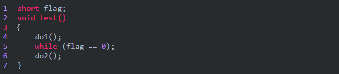
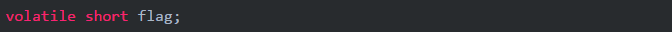
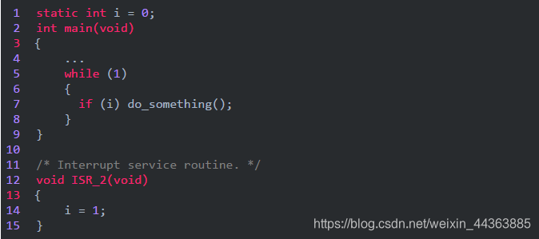
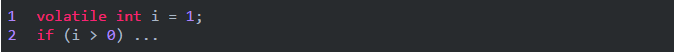
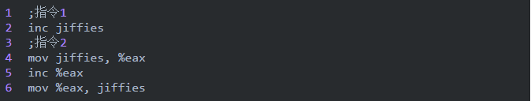
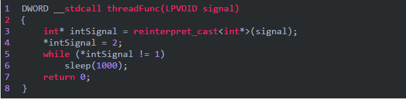
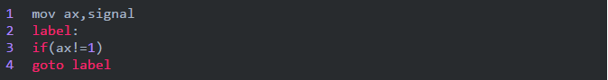
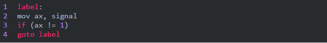

# volatile（c++）

## 1.volatile

被 `volatile` 修饰的变量，在对其进行读写操作时，会引发一些**可观测的副作用**。而这些可观测的副作用，是由**程序之外的因素决定的**。

## 2.volatile应用
（1）并行设备的硬件寄存器（如状态寄存器）。
假设要对一个设备进行初始化，此设备的某一个寄存器为0xff800000。

```c++
int  *output = (unsigned  int *)0xff800000; //定义一个IO端口；  
int   init(void)  
{  
    int i;  
    for(i=0;i< 10;i++)
    {  
    *output = i;  
    }  
}
```
经过编译器优化后，编译器认为前面循环半天都是废话，对最后的结果毫无影响，因为最终只是将output这个指针赋值为 9，所以编译器最后给你编译编译的代码结果相当于：
```c++
int  init(void)  
{  
    *output = 9;  
}
```
如果你对此外部设备进行初始化的过程是必须是像上面代码一样顺序的对其赋值，显然优化过程并不能达到目的。反之如果你不是对此端口反复写操作，而是反复读操作，其结果是一样的，编译器在优化后，也许你的代码对此地址的读操作只做了一次。然而从代码角度看是没有任何问题的。这时候就该使用volatile通知编译器这个变量是一个不稳定的，在遇到此变量时候不要优化。

（2）一个中断服务子程序中访问到的变量；

```c++
static int i=0;

int main()
{
    while(1)
    {
    if(i) dosomething();
    }
}

/* Interrupt service routine */
void IRS()
{
	i=1;
}
```
上面示例程序的本意是产生中断时，由中断服务子程序IRS响应中断，变更程序变量i，使在main函数中调用dosomething函数，但是，由于编译器判断在main函数里面没有修改过i，因此可能只执行一次对从i到某寄存器的读操作，然后每次if判断都只使用这个寄存器里面的“i副本”，导致dosomething永远不会被调用。如果将变量i加上volatile修饰，则编译器保证对变量i的读写操作都不会被优化，从而保证了变量i被外部程序更改后能及时在原程序中得到感知。

（3）多线程应用中被多个任务共享的变量。
当多个线程共享某一个变量时，该变量的值会被某一个线程更改，应该用 volatile 声明。作用是防止编译器优化把变量从内存装入CPU寄存器中，当一个线程更改变量后，未及时同步到其它线程中导致程序出错。volatile的意思是让编译器每次操作该变量时一定要从内存中真正取出，而不是使用已经存在寄存器中的值。示例如下：
```c++
volatile  bool bStop=false;  //bStop 为共享全局变量  
//第一个线程
void threadFunc1()
{
    ...
    while(!bStop){...}
}
//第二个线程终止上面的线程循环
void threadFunc2()
{
    ...
    bStop = true;
}
```
要想通过第二个线程终止第一个线程循环，如果bStop不使用volatile定义，那么这个循环将是一个死循环，因为bStop已经读取到了寄存器中，寄存器中bStop的值永远不会变成FALSE，加上volatile，程序在执行时，每次均从内存中读出bStop的值，就不会死循环了。

是否了解volatile的应用场景是区分C/C++程序员和嵌入式开发程序员的有效办法，搞嵌入式的家伙们经常同硬件、中断、RTOS等等打交道，这些都要求用到volatile变量，不懂得volatile将会带来程序设计的灾难。

## 3.volatile常见问题
下面的问题可以看一下面试者是不是真正了解volatile。
（1）一个参数既可以是const还可以是volatile吗？为什么？
可以。一个例子是只读的状态寄存器。它是volatile因为它可能被意想不到地改变。它是const因为程序不应该试图去修改它。

（2）一个指针可以是volatile吗？为什么？
可以。尽管这并不常见。一个例子是当一个中断服务子程序修改一个指向一个buffer的指针时。

（3）下面的函数有什么错误？
```c++
int square(volatile int *ptr) 
{ 
return *ptr * *ptr; 
} 
```
这段代码有点变态，其目的是用来返回指针ptr指向值的平方，但是，由于ptr指向一个volatile型参数，编译器将产生类似下面的代码：
```c++
int square(volatile int *ptr) 
{ 
int a,b; 
a = *ptr; 
b = *ptr; 
return a * b; 
} 
```
由于*ptr的值可能被意想不到地改变，因此a和b可能是不同的。结果，这段代码可能返回的不是你所期望的平方值！正确的代码如下：
```c++
long square(volatile int *ptr) 
{ 
int a=*ptr; 
return a * a; 
} 
```
## 4.volatile使用

- volatile 关键字是一种类型修饰符，用它声明的类型变量表示可以被某些编译器未知的因素（操作系统、硬件、其它线程等）更改。所以使用 volatile 告诉编译器不应对这样的对象进行优化。

- volatile 关键字声明的变量，每次访问时都必须从内存中取出值（没有被 volatile 修饰的变量，可能由于编译器的优化，从 CPU 寄存器中取值）
- const 可以是 volatile （如只读的状态寄存器）
- 指针可以是 volatile

代码学习：

- [noopt_vola.cpp](./noopt_vola.cpp)
- [volatile.cpp](./volatile.cpp)


# *volatile介绍硬件 思考*

## volatile介绍

[详解C/C++中volatile关键字_volatile c-CSDN博客](https://blog.csdn.net/weixin_44363885/article/details/92838607)

[volatile](https://so.csdn.net/so/search?q=volatile&spm=1001.2101.3001.7020)提醒编译器它后面所定义的变量随时都有可能改变，因此编译后的程序每次需要存储或读取这个变量的时候，都会直接从变量地址中读取数据。如果没有volatile关键字，则编译器可能优化读取和存储，可能暂时使用寄存器中的值，如果这个变量由别的程序更新了的话，将出现不一致的现象。下面举例说明。在DSP开发中，经常需要等待某个事件的触发，所以经常会写出这样的程序：

这段程序等待内存变量flag的值变为1(怀疑此处是0,有点疑问,)之后才运行do2()。变量flag的值由别的程序更改，这个程序可能是某个硬件中断服务程序。例如：如果某个按钮按下的话，就会对DSP产生中断，在按键中断程序中修改flag为1，这样上面的程序就能够得以继续运行。但是，编译器并不知道flag的值会被别的程序修改，因此在它进行优化的时候，可能会把flag的值先读入某个寄存器，然后等待那个寄存器变为1。如果不幸进行了这样的优化，那么while循环就变成了死循环，因为寄存器的内容不可能被中断服务程序修改。为了让程序每次都读取真正flag变量的值，就需要定义为如下形式：

需要注意的是，没有volatile也可能能正常运行，但是可能修改了编译器的优化级别之后就又不能正常运行了。因此经常会出现debug版本正常，但是release版本却不能正常的问题。所以为了安全起见，只要是等待别的程序修改某个变量的话，就加上volatile关键字。

volatile的本意是“易变的”,由于访问寄存器的速度要快过RAM，所以编译器一般都会作减少存取外部RAM的优化。比如：

程序的本意是希望ISR_2中断产生时，在main当中调用do_something函数，但是，由于编译器判断在main函数里面没有修改过i，因此可能只执行一次对从i到某寄存器的读操作，然后每次if判断都只使用这个寄存器里面的“i副本”，导致do_something永远也不会被调用。如果变量加上volatile修饰，则编译器保证对此变量的读写操作都不会被优化（肯定执行）。此例中i也应该如此说明。
一般说来，volatile用在如下的几个地方：
1、中断服务程序中修改的供其它程序检测的变量需要加volatile；
2、多任务环境下各任务间共享的标志应该加volatile；
3、存储器映射的硬件寄存器通常也要加volatile说明，因为每次对它的读写都可能由不同意义；
另外，以上这几种情况经常还要同时考虑数据的完整性（相互关联的几个标志读了一半被打断了重写），在1中可以通过关中断来实现，2中可以禁止任务调度，3中则只能依靠硬件的良好设计了。

## volatile 的含义

volatile总是与优化有关，编译器有一种技术叫做数据流分析，分析程序中的变量在哪里赋值、在哪里使用、在哪里失效，分析结果可以用于常量合并，常量传播等优化，进一步可以死代码消除。但有时这些优化不是程序所需要的，这时可以用volatile关键字禁止做这些优化，volatile的字面含义是易变的，它有下面的作用：

**1** 不会在两个操作之间把volatile变量缓存在寄存器中。在多任务、中断、甚至setjmp环境下，变量可能被其他的程序改变，编译器自己无法知道，volatile就是告诉编译器这种情况。

**2** 不做常量合并、常量传播等优化，所以像下面的代码：

if的条件不会当作无条件真。

**3** 对volatile变量的读写不会被优化掉。如果你对一个变量赋值但后面没用到，编译器常常可以省略那个赋值操作，然而对Memory Mapped IO的处理是不能这样优化的。
前面有人说volatile可以保证对内存操作的原子性，这种说法不大准确，其一，x86需要LOCK前缀才能在SMP下保证原子性，其二，RISC根本不能对内存直接运算，要保证原子性得用别的方法，如atomic_inc。
对于jiffies，它已经声明为volatile变量，我认为直接用jiffies++就可以了，没必要用那种复杂的形式，因为那样也不能保证原子性。
你可能不知道在Pentium及后续CPU中，下面两组指令作用相同，但一条指令反而不如三条指令快。


## **编译器优化 → C关键字volatile → memory破坏描述符**

memory比较特殊，可能是内嵌汇编中最难懂部分。为解释清楚它，先介绍一下编译器的优化知识，再看C关键字volatile。最后去看该描述符。

**1、编译器优化介绍**

内存访问速度远不及CPU处理速度，为提高机器整体性能，在硬件上引入硬件高速缓存Cache，加速对内存的访问。另外在现代CPU中指令的执行并不一定严格按照顺序执行，没有相关性的指令可以乱序执行，以充分利用CPU的指令流水线，提高执行速度。以上是硬件级别的优化。再看软件一级的优化：一种是在编写代码时由程序员优化，另一种是由编译器进行优化。编译器优化常用的方法有：将内存变量缓存到寄存器；调整指令顺序充分利用CPU指令流水线，常见的是重新排序读写指令。对常规内存进行优化的时候，这些优化是透明的，而且效率很好。由编译器优化或者硬件重新排序引起的问题的解决办法是在从硬件（或者其他处理器）的角度看必须以特定顺序执行的操作之间设置内存屏障（memory barrier），linux 提供了一个宏解决编译器的执行顺序问题。

这个函数通知编译器插入一个内存屏障，但对硬件无效，编译后的代码会把当前CPU寄存器中的所有修改过的数值存入内存，需要这些数据的时候再重新从内存中读出。

**2、C语言关键字volatile**

C语言关键字volatile（注意它是用来修饰变量而不是上面介绍的volatile）表明某个变量的值可能在外部被改变，因此对这些变量的存取不能缓存到寄存器，每次使用时需要重新存取。该关键字在多线程环境下经常使用，因为在编写多线程的程序时，同一个变量可能被多个线程修改，而程序通过该变量同步各个线程，例如：

该线程启动时将**intSignal**置为**2**，然后循环等待直到intSignal为1时退出。显然intSignal的值必须在外部被改变，否则该线程不会退出。但是实际运行的时候该线程却不会退出，即使在外部将它的值改为1，看一下对应的伪汇编代码就明白了：

对于C编译器来说，它并不知道这个值会被其他线程修改。自然就把它cache在寄存器里面。记住，C 编译器是没有线程概念的！这时候就需要用到volatile。volatile 的本意是指：这个值可能会在当前线程外部被改变。也就是说，我们要在**threadFunc**中的**intSignal**前面加上volatile关键字，这时候，编译器知道该变量的值会在外部改变，因此每次访问该变量时会重新读取，所作的循环变为如下面伪码所示：

**3、Memory**

有了上面的知识就不难理解Memory修改描述符了，Memory描述符告知GCC：
1）不要将该段内嵌汇编指令与前面的指令重新排序；也就是在执行内嵌汇编代码之前，它前面的指令都执行完毕。
2）不要将变量缓存到寄存器，因为这段代码可能会用到内存变量，而这些内存变量会以不可预知的方式发生改变，因此GCC插入必要的代码先将缓存到寄存器的变量值写回内存，如果后面又访问这些变量，需要重新访问内存。
如果汇编指令修改了内存，但是GCC 本身却察觉不到，因为在输出部分没有描述，此时就需要在修改描述部分增加“memory”，告诉GCC 内存已经被修改，GCC 得知这个信息后，就会在这段指令之前，插入必要的指令将前面因为优化Cache 到寄存器中的变量值先写回内存，如果以后又要使用这些变量再重新读取。
使用“volatile”也可以达到这个目的，但是我们在每个变量前增加该关键字，不如使用“memory”方便。
