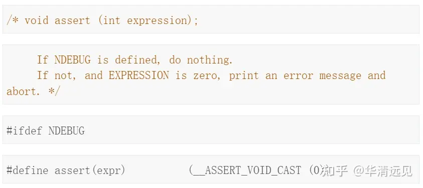
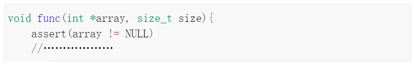
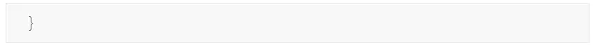
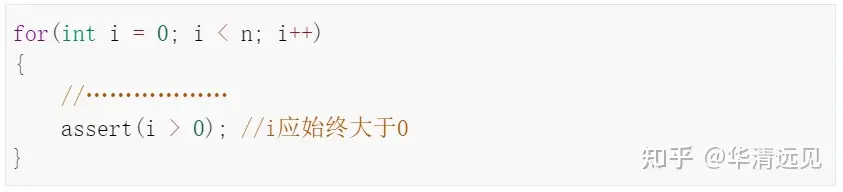
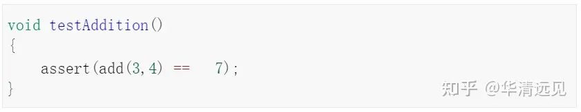
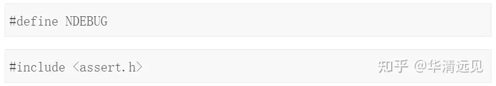
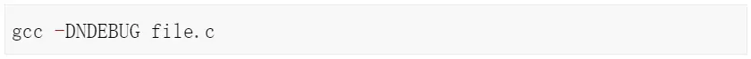

# assert那些事

## 1.第一个断言案例

断言，**是宏，而非函数**。

assert 宏的原型定义在 <assert.h>（C）、<cassert>（C++）中。其作用是如果它的条件返回错误，则终止程序执行。

可以通过定义 `NDEBUG` 来关闭 assert，**但是需要在源代码的开头，include <assert.h> 之前。**

```c
void assert(int expression);
```

> 代码样例：[assert.c](./assert.c)
```c
#include <stdio.h> 
#include <assert.h> 

int main() 
{ 
    int x = 7; 

    /*  Some big code in between and let's say x  
    is accidentally changed to 9  */
    x = 9; 

    // Programmer assumes x to be 7 in rest of the code 
    assert(x==7); 

    /* Rest of the code */

    return 0; 
} 
```
输出：
```c
assert: assert.c:13: main: Assertion 'x==7' failed.
```
可以看到输出会把源码文件，行号错误位置，提示出来！

## 2.断言与正常错误处理

+ 断言主要用于检查逻辑上不可能的情况。

>例如，它们可用于检查代码在开始运行之前所期望的状态，或者在运行完成后检查状态。与正常的错误处理不同，断言通常在运行时被禁用。

+ 忽略断言，在代码开头加上：
```c++
#define NDEBUG          // 加上这行，则 assert 不可用
```

> 样例代码：[ignore_assert.c](./ignore_assert.c)

# assert在嵌入式中的

对于断言，相信大家都不陌生，大多数编程语言也都有断言这一特性。简单地讲，断言就是对某种假设条件进行检查。

在开始使用断言assert之前，我们需要先了解一下断言函数assert，首先必须要明白assert是一个宏，并不是函数，它的原型定义在头文件assert.h中：



assert 将通过检查表达式 expression 的值来决定是否需要终止执行程序。也就是说，如果表达式 expression 的值为假（即为 0），那么它将首先向标准错误流 stderr 打印一条出错信息，然后再通过调用 abort 函数终止程序运行。否则，assert 无任何作用。

简单来说assert()用于检查程序中的某个条件（表达式）是否成立。如果成立，程序继续运行；如果不成立，将打印一条错误信息并终止程序。

在不同的编译环境下，assert()打印的错误消息可能不一样，但至少包括断言失败的表达式、失败发生的型号以及源文件名称。但是需要明白断言是用来检查非法情况的，而不是测试和处理错误的。

## **一、assert()实际应用场景**

在实际的开发中，根据断言的含义可以分为以下几种常见的应用场景：

### **1、验证函数的先决条件**

在开发中，经常会有一些明确的先决条件，比如函数需要一个非空指针，那么我们可以在开发和测试阶段使用assert()快速地捕获问题。





### **2、检验算法的不完整性**

算法中偶尔有一些不变性，即某些条件始终为真。例如，某个指针不应该为空，某个值始终应该为正数等。assert()可以用来在开发时捕捉这些不变性发生改变。



### **3、用于单元测试**

虽然不是最常用的单元测试，但是assert()可以用于基本的单元测试，验证函数的输出是否和预期一致。



### **4、验证后置条件**

与先决条件类似，函数有时还有一些明确的后置条件，如返回值始终在特定范围内等。assert()可以用于验证这些后置条件。

## **二、禁用assert**

assert()的主要作用是帮助程序员找到程序中的错误，而不是处理用户错误或者可预期的运行时错误。通常情况下，程序调试完成之后会禁用所有的assert()。

**发布程序时禁用assert()的原因是很多方面的，比如：**

1. **性能考虑：**断言可能会在运行时引起额外的开销，特别是在执行了大量检查的密集计算任务中。禁用断言可以消除这些额外的开销。

**2. 用户体验：**断言失败通道会导致程序立即终止，并向标准错误输出一条信息，这在开发和测试阶段很有用，但在生产环境中可能会导致令用户困惑的行为。

**3. 安全考虑：**在某些情况下，断言可能会暴露敏感信息或者有关软件内部工作方式的详细信息，从而可能被恶意用户利用。

**在C语言中可以通过定义宏 NDEBUG 来禁用assert():**

**1、在源代码中禁用**

包含在<assert.h>之前定义NDEBUG宏，就可以禁用所有的assert()：



**2、在编译时禁用**

在编译命令行中定义NDEBUG宏。例如，使用GCC编译器时：



## **三、总结**

断言是C语言中一个强大的调试工具，允许开发人员确保程序中的条件一定为真。通过灵活地使用assert()，可以更加容易地识别潜在问题，并且在早期阶段捕获它们，从而提高代码的质量和可靠性。

需要注意的是，断言主要用于开发和调试阶段，帮助我们及时捕获程序中隐藏的BUG，它不能代替生产环境中的错误处理机制。在生产环境中，我们应该实施健壮的错误检测和处理策略，以确保软件的稳定和可靠运行。

在对断言的使用中，一定要遵循这样一条规定：对来自系统内部的可靠的数据使用断言，对于外部不可靠数据不能够使用断言，而应该使用错误处理代码。换句话说，断言是用来处理不应该发生的非法情况，而对于可能会发生且必须处理的情况应该使用错误处理代码，而不是断言。
