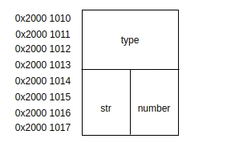
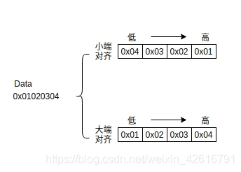

# UNION


联合（union）是一种节省空间的特殊的类，一个 union 可以有多个数据成员，但是在任意时刻只有一个数据成员可以有值。当某个成员被赋值后其他成员变为未定义状态。联合有如下特点：

- 默认访问控制符为 public
- 可以含有构造函数、析构函数
- 不能含有引用类型的成员
- 不能继承自其他类，不能作为基类
- 不能含有虚函数
- 匿名 union 在定义所在作用域可直接访问 union 成员
- 匿名 union 不能包含 protected 成员或 private 成员
- 全局匿名联合必须是静态（static）的

# UNION在嵌入式中的应用

## union 概念

union 在中文的叫法中又被称为共用体，联合或者联合体，它定义的方式与 struct 是相同的，但是意义却与 struct 完全不同，下面是 union 的定义格式：

```c
union 共用体名
{
	成员列表
}共用体变量名;
```

那么它与结构体的定义方式相同，那么区别是什么呢，下面通过一个 struct 与 union 的嵌套来说明两者的区别所在。

```c
struct my_struct
{
	int type;
	union my_union
	{
		char *str;
		int number;
	}value;
}Elem_t;
```

访问方式是同结构体是一样的，比如我要访问 number 变量，那么就可以以如下的方式进行访问：

	Elem_t.value.number = 10;
union 与 struct 的区别是什么呢？用一句话概括就是共用体中的成员的地址都是一样的，结构体中的成员都具有各自的地址，下面用一张图展示 Elem_t 在内存中的存储。



看到变量在内存中的存储位置之后，也就明白 union 的特性了，对于这样存储的好处显而易见，程序中能够使用不同类型的变量并且只占用一个变量的存储空间，能够节省存储空间。上述程序中共用体的中两个成员所占的存储空间大小一样，都是四个字节，所以最终这个共用体所占存储空间的大小就是四个字节，如果共用体的成员的存储空间大小不一样，那么共用体存储空间的大小取决于成员中存储空间最大的一个。

## union 的应用

### 使用 union 来打包数据

在使用联合在打包数据的时候，必须要清楚当前处理器是大端对齐还是小端对齐。

- 大端对齐：数据的低位保存在内存的高地址中，数据的高位保存的内存的低地址中。

- 小端对齐：数据的低位保存在内存的低地址中，数据的高位保存在内存的高地址中。

下面用图的形式举一个例子分别在大端对齐和小端对齐中的存储形式。



有了大端对齐和小端对齐的认知下，我们来看 union 如何对数据进行打包，下面给出一段代码：

```c
#include <stdio.h>
int main(void)
{
    union
    {
        unsigned int word;
        struct
        {
            unsigned char byte1;
            unsigned char byte2;
        }byte;
    }u1;

    u1.byte.byte1 = 0x21;
    u1.byte.byte2 = 0x43;
    printf("The Value of word is:0x%x\n",u1.word);

}
```

上述的运行结果会根据对齐方式的不一样而有所差别。
如果是小端模式：

```c
 The Value of word is:0x4321
```

如果是大端模式：

```c
The Value of word is:0x2143
```

当然对于采用这种方式进行数据的打包来说，弊端也是很明显的，因为会因为处理器的对齐方式而产生不同的结果，所以，我们往往采用的都是通过数据移位的方式来实现：

```c
uint8_t byte3 = 0x21;
uint8_t byte4 = 0x43;
uint16_t word;
word = (((uint16_t)byte4) << 8)|((uint16_t)byte3);
```

上述的写法便不会收到处理器对齐方式的影响，也具有更好地移植性。

### union 在数据传输中的应用

背景：现在有两个小车需要进行通信，分别是小车 A 和小车 B ，有些时候，小车 A 需要向小车 B 发送它当前的速度，有些时候，小车 A 需要向小车 B 发送它当前的位置，而有些时候小车 A 需要向小车 B 发送它当前的状态。

分析：在上面的背景当中，我们得知发送的消息的时候并不是同时要发送速度，状态，位置，而是这三个参数分开来的，并不是同时需要，那这个时候，我们就可以采用 union 的特性来构造一个数据结构，这样做的好处是能够缩减变量占用的内存，比如说我们不采用 union 来构造的话，通常我们会采用结构体的方式，比如这样：

```c
struct buffer
{
	uint8_t power;   /*当前电池容量*/
	uint8_t op_mode; /*操作模式*/
	uint8_t temp;    /*当前的温度*/
	uint16_t x_pos;
	uint16_t y_pos;
	uint16_t vel;   /*小车当前的速度*/
}my_buff;
```

采用上述的结构的话，我们可以计算一下（不考虑内存对齐的情况，内存对齐的话要对结构体内存进行填充，笔者打算后面单写一篇文章记录内存对齐的问题），结构体占用的存储空间是 9 个字节，为了优化我们的代码，我们可以采用如下的方式来构造我们要传输的数据。

```C
union 
{
	struct
	{
		uint8_t power;
		uint8_t op_mode;
		uint8_t temp;
	}status;

	struct
	{
		uint16_t x_pos;
		uint16_t y_pos;
	}position;
	
	uint16_t vel;

}msg_union;
```

这样一来，从存储空间来讲，这个 union 所占的空间只有 4 个字节。
如果要将发送的数据封装成一个数据帧，那上面所定义的 union 就存在问题了，因为接收方就不知道发送方发过去的是哪个参数，因此，需要在里面加入参数类型这个变量，于是就有了如下的代码：

```c
struct
{
	uint8_t msg_type;
	union
	{
		struct
		{
			uint8_t power;
			uint8_t op_mode;
			uint8_t temp;			
		}status;

		struct
		{
			uint16_t x_pos;
			uint16_t y_pos;
		}position;
	
		uint16_t vel;
	}msg_union; 

}message;
```

有了 msg_type 的加入，我们就可以在接收端对数据进行解析了。

小结:

通过上述的这个例子，我们现在来回顾一下，如果不使用 union 的话，在进行数据传输的时候，直接将由 struct 构造的数据形成数据帧发送过去，发送的数据包要比使用 union 构造的数据大不少，使用 union 构造数据，既能够帮助我们节省了存储空间，还节省了通信时的带宽。

### union 在数据解析中的应用

上面一个例子我们使用 union 在数据传输中优化了代码，那么 union 在数据解析中又具有什么作用呢，看下面这样一段代码：

```c
typedef union
{
	uint8_t buffer[PACKET_SIZE];

	struct
	{
		uint8_t size;
		uint8_t CMD;
		uint8_t payload[PAYLOAD_SIZE];
		uint8_t crc;
	}fields;

}PACKET_t;

// 函数调用方法： packet_builder(packet.buffer,new_data)
// 将新数据存到 buffer 的时候，还需要一些额外的操作
// 比如应该将 size 存放 buffer[0]中
// 将 cmd 存放到 buffer[1] 中，依次类推
void packet_builder(uint8_t *buffer,uint8_t data)
{
	static uint8_t received_bytes = 0;
	buffer[received_bytes++] = data; 
}

void packet_handler(PACKET_t *packet)
{
	if (packet->fields.size > TOO_BIG)
	{
		//错误
	}
	if (packet->fields.cmd == CMD)
	{
		//处理对应的数据
	}
}

```

要理解这个数据解析过程，需要用到 union 中的成员存放在同一个地址这个特性，buffer[PACKET_SIZE]中的元素与 fields 中的元素是一一对应的，用一张图来表示就很清楚了，如下图：

看了这张图，我想就很清楚了，往 buffer 里写了数据，直接从 fileds 里面读出来就可以了。

### 总结

运用好 union 不仅仅是能够节省存储空间，用好地址共享这个特性也能够实现很精妙的效果，笔者之前都没怎么用过 union，这几天关于 union 的学习也使笔者意识到路漫漫其修远兮，但是也引用胡适先生的一句话：怕什么真理无穷，进一寸有一寸的欢喜。

参考资料：
[1] https://www.allaboutcircuits.com/technical-articles/union-in-c-language-for-packing-and-unpacking-data/
[2] https://www.allaboutcircuits.com/technical-articles/learn-embedded-c-programming-language-understanding-union-data-object/.
[3] https://stackoverflow.com/questions/252552/why-do-we-need-c-unions.

