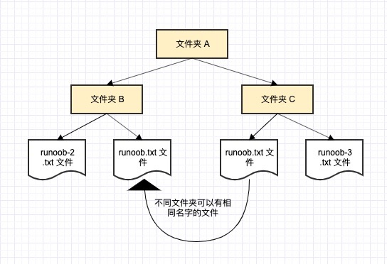

# C++ 命名空间

假设这样一种情况，当一个班上有两个名叫 Zara 的学生时，为了明确区分它们，我们在使用名字之外，不得不使用一些额外的信息，比如他们的家庭住址，或者他们父母的名字等等。

同样的情况也出现在 C++ 应用程序中。例如，您可能会写一个名为 xyz() 的函数，在另一个可用的库中也存在一个相同的函数 xyz()。这样，编译器就无法判断您所使用的是哪一个 xyz() 函数。

因此，引入了**命名空间**这个概念，专门用于解决上面的问题，它可作为附加信息来区分不同库中相同名称的函数、类、变量等。使用了命名空间即定义了上下文。本质上，命名空间就是定义了一个范围。

我们举一个计算机系统中的例子，一个文件夹(目录)中可以包含多个文件夹，每个文件夹中不能有相同的文件名，但不同文件夹中的文件可以重名。



## 定义命名空间

命名空间的定义使用关键字 **namespace**，后跟命名空间的名称，如下所示：

```
namespace namespace_name {   // 代码声明 }
```

为了调用带有命名空间的函数或变量，需要在前面加上命名空间的名称，如下所示：

```
name::code;  // code 可以是变量或函数
```

让我们来看看命名空间如何为变量或函数等实体定义范围：

**实例**

```cpp
#include <iostream>
using namespace std;
 
// 第一个命名空间
namespace first_space{
   void func(){
      cout << "Inside first_space" << endl;
   }
}
// 第二个命名空间
namespace second_space{
   void func(){
      cout << "Inside second_space" << endl;
   }
}
int main ()
{
 
   // 调用第一个命名空间中的函数
   first_space::func();
   
   // 调用第二个命名空间中的函数
   second_space::func(); 
 
   return 0;
}
```

当上面的代码被编译和执行时，它会产生下列结果：

```
Inside first_space
Inside second_space
```

## using 指令

您可以使用 **using namespace** 指令，这样在使用命名空间时就可以不用在前面加上命名空间的名称。这个指令会告诉编译器，后续的代码将使用指定的命名空间中的名称。

**实例**

```cpp
#include <iostream>
using namespace std;
 
// 第一个命名空间
namespace first_space{
   void func(){
      cout << "Inside first_space" << endl;
   }
}
// 第二个命名空间
namespace second_space{
   void func(){
      cout << "Inside second_space" << endl;
   }
}
using namespace first_space;
int main ()
{
 
   // 调用第一个命名空间中的函数
   func();
   
   return 0;
}
```

当上面的代码被编译和执行时，它会产生下列结果：

```
Inside first_space
```

using 指令也可以用来指定命名空间中的特定项目。例如，如果您只打算使用 std 命名空间中的 cout 部分，您可以使用如下的语句：

```
using std::cout;
```

随后的代码中，在使用 cout 时就可以不用加上命名空间名称作为前缀，但是 **std** 命名空间中的其他项目仍然需要加上命名空间名称作为前缀，如下所示：

实例

```cpp
#include <iostream>
using std::cout;
 
int main ()
{
 
   cout << "std::endl is used with std!" << std::endl;
   
   return 0;
}
```

当上面的代码被编译和执行时，它会产生下列结果：

```
std::endl is used with std!
```

**using** 指令引入的名称遵循正常的范围规则。名称从使用 **using** 指令开始是可见的，直到该范围结束。此时，在范围以外定义的同名实体是隐藏的。

## 不连续的命名空间

命名空间可以定义在几个不同的部分中，因此命名空间是由几个单独定义的部分组成的。一个命名空间的各个组成部分可以分散在多个文件中。

所以，如果命名空间中的某个组成部分需要请求定义在另一个文件中的名称，则仍然需要声明该名称。下面的命名空间定义可以是定义一个新的命名空间，也可以是为已有的命名空间增加新的元素：

```cpp
namespace namespace_name {   
	// 代码声明 
}
```


## 嵌套的命名空间

命名空间可以嵌套，您可以在一个命名空间中定义另一个命名空间，如下所示：

```cpp
#include <iostream>
using std::cout;
 
int main ()
{
 
   cout << "std::endl is used with std!" << std::endl;
   
   return 0;
}
```

您可以通过使用 **::** 运算符来访问嵌套的命名空间中的成员：

```cpp
// 访问 namespace_name2 中的成员
using namespace namespace_name1::namespace_name2;
 
// 访问 namespace_name1 中的成员
using namespace namespace_name1;
```

在上面的语句中，如果使用的是 namespace_name1，那么在该范围内 namespace_name2 中的元素也是可用的，如下所示：

**实例**

```cpp
#include <iostream>
using namespace std;
 
// 第一个命名空间
namespace first_space{
   void func(){
      cout << "Inside first_space" << endl;
   }
   // 第二个命名空间
   namespace second_space{
      void func(){
         cout << "Inside second_space" << endl;
      }
   }
}
using namespace first_space::second_space;
int main ()
{
 
   // 调用第二个命名空间中的函数
   func();
   
   return 0;
}
```

当上面的代码被编译和执行时，它会产生下列结果：

```
Inside second_space
```