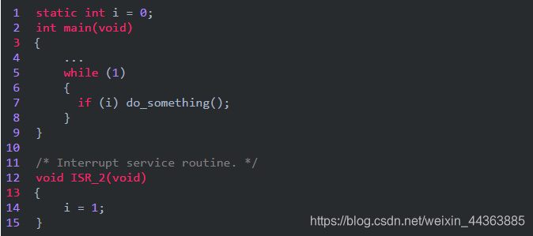

[详解C/C++中volatile关键字_volatile c-CSDN博客](https://blog.csdn.net/weixin_44363885/article/details/92838607)

## *一、volatile介绍*

volatile提醒编译器它后面所定义的变量随时都有可能改变，因此编译后的程序每次需要存储或读取这个变量的时候，都会直接从变量地址中读取数据。如果没有volatile关键字，则编译器可能优化读取和存储，可能暂时使用寄存器中的值，如果这个变量由别的程序更新了的话，将出现不一致的现象。下面举例说明。在DSP开发中，经常需要等待某个事件的触发，所以经常会写出这样的程序：

这段程序等待内存变量flag的值变为1(怀疑此处是0,有点疑问,)之后才运行do2()。变量flag的值由别的程序更改，这个程序可能是某个硬件中断服务程序。例如：如果某个按钮按下的话，就会对DSP产生中断，在按键中断程序中修改flag为1，这样上面的程序就能够得以继续运行。但是，编译器并不知道flag的值会被别的程序修改，因此在它进行优化的时候，可能会把flag的值先读入某个寄存器，然后等待那个寄存器变为1。如果不幸进行了这样的优化，那么while循环就变成了死循环，因为寄存器的内容不可能被中断服务程序修改。为了让程序每次都读取真正flag变量的值，就需要定义为如下形式：

需要注意的是，没有volatile也可能能正常运行，但是可能修改了编译器的优化级别之后就又不能正常运行了。因此经常会出现debug版本正常，但是release版本却不能正常的问题。所以为了安全起见，只要是等待别的程序修改某个变量的话，就加上volatile关键字。

volatile的本意是“易变的”,由于访问寄存器的速度要快过RAM，所以编译器一般都会作减少存取外部RAM的优化。比如：

程序的本意是希望ISR_2中断产生时，在main当中调用do_something函数，但是，由于编译器判断在main函数里面没有修改过i，因此可能只执行一次对从i到某寄存器的读操作，然后每次if判断都只使用这个寄存器里面的“i副本”，导致do_something永远也不会被调用。如果变量加上volatile修饰，则编译器保证对此变量的读写操作都不会被优化（肯定执行）。此例中i也应该如此说明。
一般说来，volatile用在如下的几个地方：
1、中断服务程序中修改的供其它程序检测的变量需要加volatile；
2、多任务环境下各任务间共享的标志应该加volatile；
3、存储器映射的硬件寄存器通常也要加volatile说明，因为每次对它的读写都可能由不同意义；
另外，以上这几种情况经常还要同时考虑数据的完整性（相互关联的几个标志读了一半被打断了重写），在1中可以通过关中断来实现，2中可以禁止任务调度，3中则只能依靠硬件的良好设计了。

### **二、volatile 的含义**

volatile总是与优化有关，编译器有一种技术叫做数据流分析，分析程序中的变量在哪里赋值、在哪里使用、在哪里失效，分析结果可以用于常量合并，常量传播等优化，进一步可以死代码消除。但有时这些优化不是程序所需要的，这时可以用volatile关键字禁止做这些优化，volatile的字面含义是易变的，它有下面的作用：

**1** 不会在两个操作之间把volatile变量缓存在寄存器中。在多任务、中断、甚至setjmp环境下，变量可能被其他的程序改变，编译器自己无法知道，volatile就是告诉编译器这种情况。

**2** 不做常量合并、常量传播等优化，所以像下面的代码：

if的条件不会当作无条件真。

**3** 对volatile变量的读写不会被优化掉。如果你对一个变量赋值但后面没用到，编译器常常可以省略那个赋值操作，然而对Memory Mapped IO的处理是不能这样优化的。
前面有人说volatile可以保证对内存操作的原子性，这种说法不大准确，其一，x86需要LOCK前缀才能在SMP下保证原子性，其二，RISC根本不能对内存直接运算，要保证原子性得用别的方法，如atomic_inc。
对于jiffies，它已经声明为volatile变量，我认为直接用jiffies++就可以了，没必要用那种复杂的形式，因为那样也不能保证原子性。
你可能不知道在Pentium及后续CPU中，下面两组指令作用相同，但一条指令反而不如三条指令快。

### **三、编译器优化 → C关键字volatile → memory破坏描述符**

memory比较特殊，可能是内嵌汇编中最难懂部分。为解释清楚它，先介绍一下编译器的优化知识，再看C关键字volatile。最后去看该描述符。

**1、编译器优化介绍**

内存访问速度远不及CPU处理速度，为提高机器整体性能，在硬件上引入硬件高速缓存Cache，加速对内存的访问。另外在现代CPU中指令的执行并不一定严格按照顺序执行，没有相关性的指令可以乱序执行，以充分利用CPU的指令流水线，提高执行速度。以上是硬件级别的优化。再看软件一级的优化：一种是在编写代码时由程序员优化，另一种是由编译器进行优化。编译器优化常用的方法有：将内存变量缓存到寄存器；调整指令顺序充分利用CPU指令流水线，常见的是重新排序读写指令。对常规内存进行优化的时候，这些优化是透明的，而且效率很好。由编译器优化或者硬件重新排序引起的问题的解决办法是在从硬件（或者其他处理器）的角度看必须以特定顺序执行的操作之间设置内存屏障（memory barrier），linux 提供了一个宏解决编译器的执行顺序问题。

这个函数通知编译器插入一个内存屏障，但对硬件无效，编译后的代码会把当前CPU寄存器中的所有修改过的数值存入内存，需要这些数据的时候再重新从内存中读出。

**2、C语言关键字volatile**

C语言关键字volatile（注意它是用来修饰变量而不是上面介绍的volatile）表明某个变量的值可能在外部被改变，因此对这些变量的存取不能缓存到寄存器，每次使用时需要重新存取。该关键字在多线程环境下经常使用，因为在编写多线程的程序时，同一个变量可能被多个线程修改，而程序通过该变量同步各个线程，例如：

该线程启动时将**intSignal**置为**2**，然后循环等待直到intSignal为1时退出。显然intSignal的值必须在外部被改变，否则该线程不会退出。但是实际运行的时候该线程却不会退出，即使在外部将它的值改为1，看一下对应的伪汇编代码就明白了：

对于C编译器来说，它并不知道这个值会被其他线程修改。自然就把它cache在寄存器里面。记住，C 编译器是没有线程概念的！这时候就需要用到volatile。volatile 的本意是指：这个值可能会在当前线程外部被改变。也就是说，我们要在**threadFunc**中的**intSignal**前面加上volatile关键字，这时候，编译器知道该变量的值会在外部改变，因此每次访问该变量时会重新读取，所作的循环变为如下面伪码所示：

**3、Memory**

有了上面的知识就不难理解Memory修改描述符了，Memory描述符告知GCC：
1）不要将该段内嵌汇编指令与前面的指令重新排序；也就是在执行内嵌汇编代码之前，它前面的指令都执行完毕。
2）不要将变量缓存到寄存器，因为这段代码可能会用到内存变量，而这些内存变量会以不可预知的方式发生改变，因此GCC插入必要的代码先将缓存到寄存器的变量值写回内存，如果后面又访问这些变量，需要重新访问内存。
如果汇编指令修改了内存，但是GCC 本身却察觉不到，因为在输出部分没有描述，此时就需要在修改描述部分增加“memory”，告诉GCC 内存已经被修改，GCC 得知这个信息后，就会在这段指令之前，插入必要的指令将前面因为优化Cache 到寄存器中的变量值先写回内存，如果以后又要使用这些变量再重新读取。
使用“volatile”也可以达到这个目的，但是我们在每个变量前增加该关键字，不如使用“memory”方便。