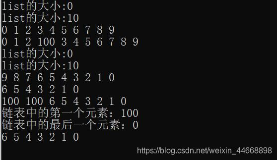

[【总结】C++ 基础数据结构 —— STL之链表（list）用法详解_c++ stl list-CSDN博客](https://blog.csdn.net/weixin_44668898/article/details/102154927)

## 一、list 的介绍

1. list 是 STL 中的一个序列容器，实现的是双向链表，每个元素都有两个指针，分别指向元素的前驱和后继。
2. list 不需要指定内存大小，因为他存储在不连续的内存空间中，并由指针将他们连接在一起。

3. 由于链表的特点，不能进行内部的随机访问，无法通过位置来访问元素，即不支持[ ] 操作符和vector.at() 操作，必须逐个遍历，可以通过开始元素或者最后一个元素遍历，它的查找要在O(n)的时间才能完成。但它允许序列快速在任意位置进行插入和删除操作作，包括在两边的pop()和push()操作。


## 二、list 的基本操作

使用STL标准库的 list 时，应包含头文件：#include <list>

### 1、定义

```cpp
list<int> l			声明一个空链表
list<int> l{1,2,3}	声明一个含指定元素的链表
list<int> l(n)    	声明一个含n个元素的链表并全部初始化为0
list<int> l(n, m)  	声明一个含n个元素的链表并全部初始化为m
list<int> l(a,b)  	声明一个链表并初始化为区间[a,b]中的元素，a、b是迭代器
```
### 2、基本操作

```cpp
增：
	l.insert() 					插入一个元素到list中
	l.push_back() 				在list的末尾添加一个元素 
	l.push_front() 				在list的头部添加一个元素
	
删：
	l.clear() 					清空list的所有元素
	l.erase() 					删除一个元素
	l.erase(l.begin(),l.end())  将l从begin()到end()之间的元素删除。
	l.pop_back() 				删除最后一个元素 
	l.pop_front() 				删除第一个元素
	l.remove() 					从list删除指定元素 
	l.remove_if() 				按指定条件删除元素
	l.unique() 					删除list中重复的元素
	
改：
	l.resize() 					改变list的大小
	l.reverse() 				把list的元素倒转
	
查：
	l.front() 					返回第一个元素 
	l.back() 					返回最后一个元素
	l.empty() 					若list是空的则返回true，否则返回false
	l.max_size() 				返回list能容纳的最大元素数量 
	l.size() 					返回list中的元素个数

其他操作：
	l.assign() 					给list赋值
	l.get_allocator() 			返回list的配置器
	l.merge() 					合并两个list
	l.begin() 					返回指向第一个元素的迭代器 
	l.end() 					返回末尾的迭代器
	l.rbegin() 					返回指向第一个元素的逆向迭代器 
	l.rend() 					指向list末尾的逆向迭代器
	l.sort() 					给list排序
	l.splice() 					合并两个list
	l.swap() 					交换两个list
```

## 三、list 的用法

### **1、基本用法**

```cpp
#include <iostream>
#include <list>
using namespace std;
int main(){
	list<int> l;
	cout<<"list的大小:"<<l.size()<<endl;
	//list的大小:0
	
	for (int i=0; i<10; i++)
		l.push_back(i); //尾部插入元素 尾插法
	cout<<"list的大小:"<<l.size()<<endl;
	//list的大小:10
	
	list<int>::iterator it = l.begin();
	while(it!=l.end()){
		cout<<*it<<" ";
		it++;
	}
	cout << endl;
	//0 1 2 3 4 5 6 7 8 9
	
	//list不能随机访问容器中的值，即不能it+5这样的操作。只能一个一个的走，即it++
	it=l.begin();
	it++;
	it++;
	it++;
	l.insert(it, 100); //100插入在链表第4个位置
	for (list<int>::iterator it = l.begin(); it != l.end(); it++)
		cout<<*it<<" ";
	cout<<endl;
	//0 1 2 100 3 4 5 6 7 8 9
	
	l.clear(); 
	
	cout<<"list的大小:"<<l.size()<<endl;
	//list的大小:0
	
	for (int i=0; i<10; i++)
		l.push_front(i); 		//尾部插入元素 尾插法
	cout<<"list的大小:"<<l.size()<<endl;
	//list的大小:10
	
	for(list<int>::iterator it=l.begin(); it!=l.end(); it++)
		cout<<*it<<" ";
	cout<<endl;        
	//9 8 7 6 5 4 3 2 1 0
	
	list<int>::iterator it1 = l.begin();
	list<int>::iterator it2 = l.begin();
	it2++;
	it2++;
	it2++;
	//要想删除一个区间段。只能用指针++一步一步的指向那个末尾位置，不能直接l.begin()+3
	l.erase(it1, it2);		//删掉的是区间[it1,it2) 
	for (list<int>::iterator it=l.begin(); it!=l.end(); it++)
		cout<<*it<<" ";
	cout<<endl;
	//6 5 4 3 2 1 0
	
	l.insert(l.begin(), 100);
	l.insert(l.begin(), 100);
	l.insert(l.begin(), 100);
	l.erase(l.begin()); 		//删除该位置的元素
	for (list<int>::iterator it=l.begin(); it!=l.end(); it++)
		cout<<*it<<" ";
	cout<<endl;
	//100 100 6 5 4 3 2 1 0
	
	cout<<"链表中的第一个元素："<<l.front()<<endl; 
	//链表中的第一个元素：100
	
	cout<<"链表中的最后一个元素："<<l.back()<<endl; 
	//链表中的最后一个元素：0
	
	l.remove(100);				//移除所有100元素的值  remove
	for (list<int>::iterator it=l.begin(); it!=l.end(); it++)
		cout<<*it<<" ";
	cout<<endl;
	//6 5 4 3 2 1 0
}
```

**输出结果：**



**2、resize()函数：** 改变list的大小

1. 调用 l.resize(n) 将 list 的长度改为只容纳 n 个元素，超出的元素将被删除。
2. 如果 n 比 list 原来的长度长，那么默认超出的部分元素置为0。
3. 也可以用resize(n, m)的方式将超出的部分赋值为m。

```cpp
list<int> l{1, 2, 3, 4};
l.resize(2);
//list中输出元素：1,2

list<int> l{1, 2, 3, 4};
l.resize(6);
//list中输出元素：1,2,3,4,0,0

list<int> l{1, 2, 3, 4};
l.resize(6,9);
//list中输出元素：1,2,3,4,9,9
```

**3、assign()函数：** 给list赋值

1. l.assign(n, val)：将 list 中的所有元素替换成n个val元素
2. l2.assign(l1.begin(), l1.end())：给链表 l2 赋链表 l1 的值

```cpp
list<int> l{1,2,3,4,5};
l.assign(5,10);
//l中的元素变为10, 10, 10, 10, 10

list<int> l1{6,7,8,9};
list<int> l2{1,2,3,4,5};
l2.assign(l1.begin(),l1.end());
//l2中的元素变为6,7,8,9
```

**4、swap()函数：** 交换两个list

l1.swap(l2) 和 swap(l1, l2)，都可以完成 l1 链表和 l2 链表的交换。

```cpp
list<int> l1{6,7,8,9};
list<int> l2{1,2,3,4,5};
swap(l1, l2); 
//或l1.swap(l2)
```

5、reverse()函数： 实现list的逆置

```cpp
list<int> l{1,2,3,4,5};
reverse(l.begin(),l.end());
//l中元素变为5，4，3，2，1
```

6、merge()函数： 合并两个list

```cpp
l1.merge(l2) 调用结束后 l2 变为空，l1 中元素包含原来 l1 和 l2 的元素。

list<int> l1{6,7,8,9};
list<int> l2{2, 1, 3, 6, 5};
l1.merge(l2,greater<int>());
//l1中元素变为：6,7,8,9,2,1,3,6,5

list<int> l1{6,7,8,9};
list<int> l2{2, 1, 3, 6, 5};
l1.merge(l2);
//l1中元素变为：2,1,3,6,5,6,7,8,9
```

7、insert()函数： 在指定位置插入一个或多个元素

l.insert(l.begin(),100);  		//在l的开始位置（即头部）插入100
l.insert(l.begin(),2, 100);  	//在l的开始位置插入2个100
l1.insert(l1.begin(), l2.begin(), l2.end());
//在l1的开始位置插入l2从开始到结束的所有位置的元素
1
2
3
4

8、remove_if()函数： 按指定条件删除元素实现list的逆置

用法1：回调函数
回调函数的原型为bool isRemove(T& obj1)。
函数名任意，如果obj1需要被移除则返回1，否则返回0。
使用方法：list.remove_if(isRemove)。
这种方法最简单，但是无法向回调函数中传递参数，每一个条件就要有一个回调函数，因此不推荐使用。
bool is_odd(constint& value){
    return (value==4);
}
int main(){
    list<int> l{6,7,4,9,7,10};
    l.remove_if(is_odd);
    list<int>::iterator it = l.begin();
    while(it != l.end()){
        cout<<*it<< " ";
        it++;
    }
    return 0;
}
//输出：6 7 9 7 10