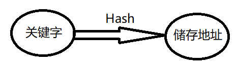
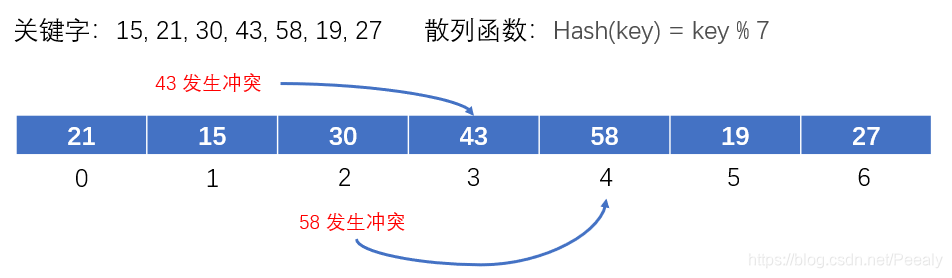
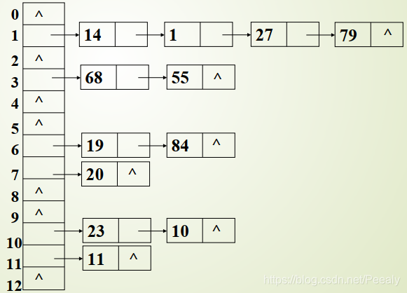

[一文看懂哈希表并学会使用C++ STL 中的哈希表_哈希表有哪些函数-CSDN博客](https://blog.csdn.net/Peealy/article/details/116895964)

## 哈希表的定义

### 哈希表的作用

    哈希表就是在关键字和存储位置之间建立对应关系，使得元素的查找可以以O(1)的效率进行， 其中关键字和存储位置之间是通过散列函数建立关系，记为:
$$
Loc(i)=Hash(key_i)
$$


### 常见的散列函数

1. 线性定址法：直接取关键字的某个线性函数作为存储地址，散列函数为：

$$
Hash(key)=a*key+b
$$
2. 除留余数法：将关键字对某一小于散列表长度的数p取余的结果作为存储地址，散列函数为：

$$
Hash(key)=key\quad mod \quad b
$$

3. 平方取中法：对关键字取平方，然后将得到结果的中间几位作为存储地址；
4. 折叠法：将关键字分割为几部分，然后将这几部分的叠加和作为存储地址。

### 地址冲突解决方法

    通过以上方法构建的哈希表在理想的情况下能够做到一个关键字对应一个地址，但是实际情况是会有冲突发生，也就是散列函数会将多个关键字映射到同一个地址上。以下是一些解决冲突的方法：

#### 开放地址法：

1. 线性探测法：

​	当发生冲突时，就顺序查看下一个存储位置，如果位置为空闲状态，就将该关键字存储在该位置上，如果还是发生冲突，就依次往后查看，当查看到存储空间的末尾时还是找不到空位置，就返回从头开始查看；



2. 平方探测法：

​	不同于前面线性探测法依次顺序查看下一个位置是否能存储元素，平方探测的规则是以:
$$
1^2,-1^2,2^2,-2^2,...,
$$
探测新的存储位置能否存储元素；

3. 再散列法：

​	利用两个散列函数，当通过第一个散列函数得到关键字的存储地址发生冲突时，再利用第二个散列函数计算出地址增量，地址计算方式如下：
$$
\mathrm{H_i}=(\mathrm{Hash}_1(\mathrm{key})+\mathrm{i}*\mathrm{Hash}_2(\mathrm{key}))\%\mathrm{p}
$$


4. 伪随机数法： 

当发生地址冲突时，加入一个随机数作为地址增量寻找新的存储地址，地址计算方式如下：
$$
\mathrm{H_i=(Hash(key)+d_i)\%p,~}\text{其中}\mathrm{d_i}\text{为随机数}
$$


#### 拉链法

    将具有相同存储地址的关键字链成一单链表， m个存储地址就设m个单链表，然后用一个数组将m个单链表的表头指针存储起来，形成一个动态的结构，假设散列函数为 Hash(key) = key %13，其拉链存储结构为：



## 如何使用STL库中的哈希表

导入头文件

```cpp
#include<unordered_map>
```

哈希表的声明和初始化

声明

```cpp
unordered_map<elemType_1, elemType_2> var_name; //声明一个没有任何元素的哈希表，
//其中elemType_1和elemType_2是模板允许定义的类型，如要定义一个键值对都为Int的哈希表：
unordered_map<int, int> map;
```

初始化

以上在声明哈希表的时候并没有给unordered_map传递任何参数，因此调用的是unordered_map的默认构造函数，生成一个空容器。初始化主要有一下几种方式：

在定义哈希表的时候通过初始化列表中的元素初始化:

```cpp
unordered_map<int, int> hmap{ {1,10},{2,12},{3,13} };
//如果知道要创建的哈希表的元素个数时，也可以在初始化列表中指定元素个数
unordered_map<int, int> hmap{ {{1,10},{2,12},{3,13}},3 };
```

通过下标运算来添加元素:

```cpp
//当我们想向哈希表中添加元素时也可以直接通过下标运算符添加元素，格式为: mapName[key]=value;
//如：hmap[4] = 14;
//但是这样的添加元素的方式会产生覆盖的问题，也就是当hmap中key为4的存储位置有值时，
//再用hmap[4]=value添加元素，会将原哈希表中key为4存储的元素覆盖
hmap[4] = 14;
hmap[5] = 15;
cout << hmap[4];  //结果为15
```

通过insert()函数来添加元素:

```cpp
//通过insert()函数来添加元素的结果和通过下标来添加元素的结果一样，不同的是insert()可以避免覆盖问题，
//insert()函数在同一个key中插入两次，第二次插入会失败
hmap.insert({ 5,15 });
hmap.insert({ 5,16 });
cout << hmap[5];  //结果为15
```

复制构造，通过其他已初始化的哈希表来初始新的表:

```cpp
unordered_map<int, int> hmap{ {1,10},{2,12},{3,13} };
unordered_map<int, int> hmap1(hmap);
```

## STL中哈希表的常用函数