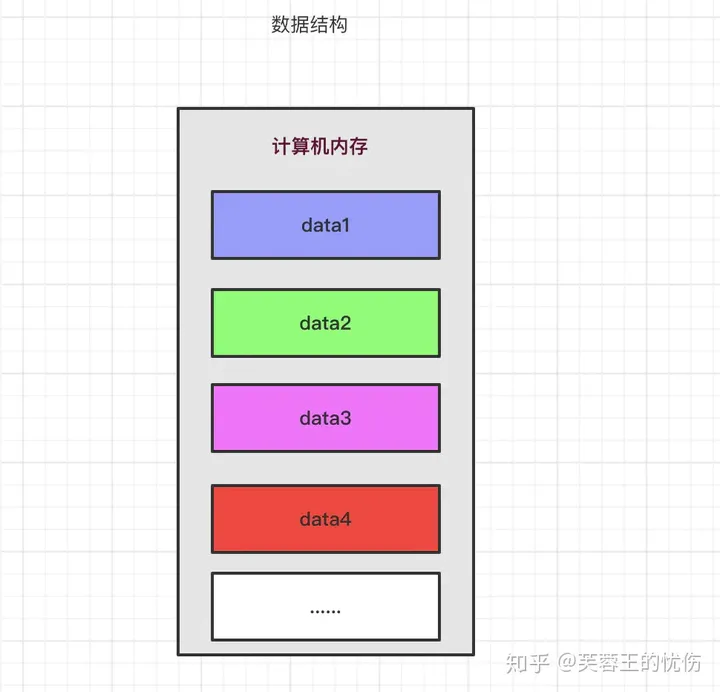
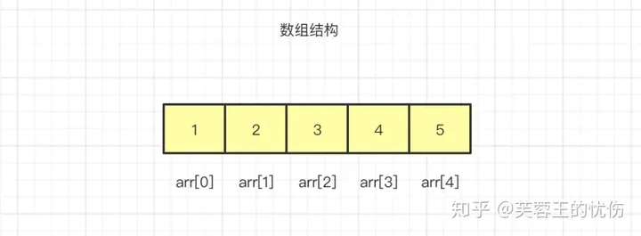
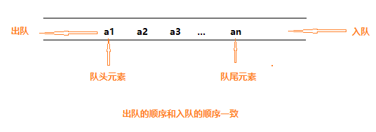
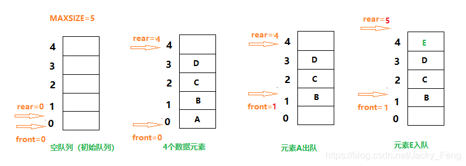
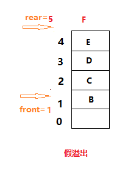
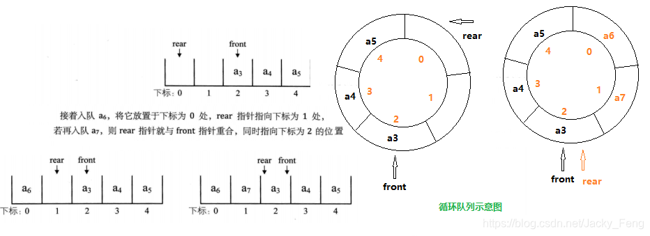
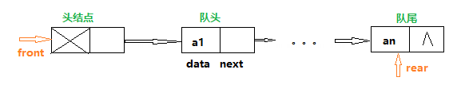
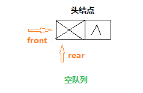
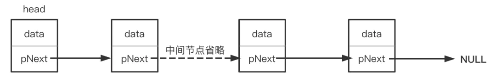
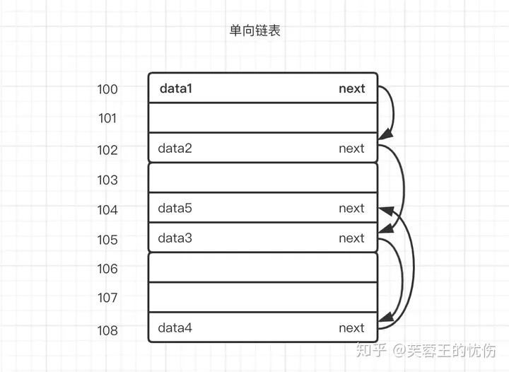

## 数据结构的定义

**数据结构(data structure)是带有结构特性的数据元素的集合，它研究的是数据的逻辑结构和数据的物理结构以及它们之间的相互关系，并对这种结构定义相适应的运算，设计出相应的算法，并确保经过这些运算以后所得到的新结构仍保持原来的结构类型。简而言之，数据结构是相互之间存在一种或多种特定关系的数据元素的集合，即带“结构”的数据元素的集合。“结构”就是指数据元素之间存在的关系，分为逻辑结构和存储结构。**



如上图所示，**数据是存储在计算机的内存里的，在存储时，决定了数据顺序和位置关系的便是“数据结构”**。

## 数据结构分类

数据结构分为**逻辑结构**和**物理结构**。

- 逻辑结构：指数据元素之间逻辑关系的数据结构，这里的逻辑关系是指数据元素之间的前后间关系，与数据在计算机中的存储位置无关。
- 物理结构：指数据的逻辑结构在计算机存储空间中的存放形式称为数据的物理结构，也叫做存储结构。

数据的逻辑结构主要分为**线性结构**和**非线性结构**。

- 线性结构：数据结构的元素之间存在一对一线性关系，所有结点都最多只有一个直接前趋结点和一个直接后继结点。常见的有数组、队列、链表、栈。
- 非线性结构：各个结点之间具有多个对应关系，一个结点可能有多个直接前趋结点和多个直接后继结点。常见的有多维数组、广义表、树结构和图结构等。

数据的物理结构（以后我都统一称存储结构），表示数据元素之间的逻辑关系，一种数据结构的逻辑结构根据需要可以表示成多种存储结构，常用的存储结构有：

- **顺序存储**：存储顺序是连续的，在内存中用一组地址连续的存储单元依次存储线性表的各个数据元素。
- **链式存储**：在内存中的存储元素不一定是连续的，用任意地址的存储单元存储元素，元素节点存放数据元素以及通过指针指向相邻元素的地址信息。
- **索引存储**：除建立存储结点信息外，还建立附加的索引表来标识节点的地址。索引表由若干索引项组成。
- **散列存储**：又称Hash存储，由节点的关键码值决定节点的存储地址。

## 常用的数据结构

- 数组（Array）
- 队列（Queue）
- 链表（Linked List）
- 栈（Stack）
- 树（Tree）
- 散列表（Hash）
- 堆（Heap）
- 图（Graph）

下面我们来先对这几个数据结构有个大概的印象。

### **数组（Array）**

数组是最简单、使用最频繁的一种数据结构。它一种线性表数据结构，用一组连续的内存空间来存储一组相同类型的数据。





如上图所示，数据是按照顺序存储在内存的连续空间内，arr后面的[]代表下标，由于数据是存储在连续空间内的，所以每个数据的内存地址(在内存上的位置)都可以通过数组下标计算出来，从而可以直接访问目标数据，达到随机访问的目的。

### **队列（Queue）**

[嵌入式学习之队列实现 - 知乎 (zhihu.com)](https://zhuanlan.zhihu.com/p/635242652)

> 在嵌入式技术中，队列是一种重要的数据结构，用于实现各种实时任务和数据流的处理。

#### 一、队列的定义

队列（queue）是只允许在一端进行插入操作，在另一端进行删除操作的线性表，简称“队”。

队列是一种先进先出（First In First Out）的线性表，简称FIFO。

允许插入的一端称为队尾（rear），允许删除的一端称为队头(front)。

向队列中插入新的数据元素称为入队，新入队的元素就成为了队列的队尾元素。

从队列中删除队头元素称为出队，其后继元素成为新的队头元素。



#### 二、队列的顺序存储结构

> 队列作为一种特殊的线性表，也同样存在两种存储结构：顺序存储结构和链式存储结构，可以分别用数组和链表来实现队列。

**1.顺序队列的定义**

用一组地址连续的存储单元，依次存放从队头到队尾的数据元素，称为**顺序队列**。

需要附设两个指针：**队头指针（front）**和 **队尾指针（rear）**，分别指向队头元素和队尾元素。

头尾指针和顺序队列中数据元素之间的关系示意图：



“假溢出”：如果在插入E的基础上再插入元素F，将会插入失败。因为rear==MAXSIZE，尾指针已经达到队列的最大长度。但实际上队列存储空间并未全部被占满，这种现象叫做“假溢出”。



假溢出的原因是顺序队列进行队头出队、队尾入队，造成数组前面会出现空闲单元未被充分利用。

**2.循环队列定义**

> 为了解决“假溢出”现象，使得队列的存储空间得到充分利用，一个巧妙的方法就是将顺序队列的数组看成一个头尾相接循环结构。
>
> 队列的头尾相接的顺序存储结构称为循环队列。
>
> 循环队列是一种**基于数组实现的队列结构**。它使用一个固定大小的数组来存储队列元素，并使用**两个指针front和rear分别指向队头和队尾**。当队列满时，新元素将被插入到队头，形成循环的效果。
>
> 循环队列使用数组作为底层数据结构，通过**前后指针的循环移动来实现队列元素的入队和出队**。与链队列相比，循环队列具有更高的存取效率，而且不需要额外的指针空间。然而，循环队列的缺点是固定大小，一旦队列满了，就无法再插入新的元素。



问题：当循环对列为空或满时，都是队尾指针等于队头指针，即rear==front 。当rear==front时，该是判满还是判空呢？

解决方案：

方案一：设置一个计数器，开始时计数器设为0，新元素入队时，计数器加1，元素出队，计数器减1。当计数器==MAXSIZE时，队满；计数器==0时，队空。

方案二：保留一个元素空间，当队尾指针指的空闲单元的后继单元是队头元素所在单元时，队满。

**队满的条件为（Q.rear+1）%MAXSIZE==Q.front；**

**队空的条件为Q.rear==Q.front**

**3.循环队列的基本操作**

```c++
typedef int ElemType
#define MAXSIZE 1024

/*循环队列的顺序存储结构*/
typedef struct
{
    ElemType data[MAXSIZE];
    int front;    //头指针
    int rear;    //尾指针
}SqQueue;

/*初始化一个空队列*/
int Init_SeQueue(SeQueue *Q)
{
    Q=(SeQueue *)malloc(sizeof(SeQueue));
    if(Q!=NULL)
    {
        Q->front=0;
        Q->rear=0;
    }
    return 1;
}

/*求队列长度*/
int QueueLength(SeQueue *Q)
{
    return (Q->rear-Q->front+MAXSIZE)%MAXSIZE;
}

/*判空*/
int SeQueue_Empty(SeQueue *Q)
{
    return Q->rear==Q->front;
}

/*判满*/
int SeQueue_Full(SeQueue *Q)
{
    return (Q->rear+1)%MAXSIZE==Q->front;
}

/*入队操作*/
int Enter_SeQueue(SeQueue *Q,ElemType e)
{
    if(SeQueue_Full(Q))
    {
        return 0;
    }

    Q->data[Q->rear]=e;
    Q->rear=(Q->rear+1)%MAXSIZE;
    return 1;

}

/*出队操作*/
int Delete_SeQueue(SeQueue *Q,ElemType e)
{
    if(SeQueue_Empty(Q))
    {
        return 0;
    }

    e=Q->data[Q->front];
    Q->front=(Q->front+1)%MAXSIZE;
    return 1;
    
}
```

#### 三、队列的链式存储结构（链队列）

> 链队列使用链表的结构来存储队列元素，它使用**两个指针front和rear分别指向队头和队尾节点**，通过不断调整这两个指针来实现入队和出队操作。入队操作在链表尾部插入新节点，出队操作在链表头部删除节点。它的优点是不受固定大小的限制，可以动态地增加或减少队列的大小。然而，由于链表需要额外的指针空间来维护节点之间的连接关系，相比于数组实现的循环队列，它可能占用更多的内存。

**1.链队列的定义**

采用链式存储结构实现的队列称为**链队列**。

为了使操作更加方便，将队头指针指向链队列的头结点，而队尾指针指向终端结点。 



**空队列时，front和rear都指向头结点，即front==rear**



**链队列的结构**

```c++
typedef int ElemType

/*结点结构*/
typedef struct QNode
{
    ElemType data;
    struct QNode *next;
}QNode,*QueuePtr;

/*链队列结构*/
typedef struct 
{
    QueuePtr front,rear;//队头、队尾指针
}LinkQueue;
```

**2.链队列的基本操作**

```c++
typedef int ElemType

/*结点结构*/
typedef struct QNode
{
    ElemType data;
    struct QNode *next;
}QNode,*QNodePtr;

/*链队列结构*/
typedef struct 
{
    QNodePtr front,rear;//队头、队尾指针
}LinkQueue,*LinkQueuePtr;

/*初始化一个空队列*/
int Init_LinkQueue(LinkQueuePtr Q)
{
    Q=(LinkQueuePtr)malloc(sizeof(LinkQueue));
    QNodePtr head=(QueuePtr)malloc(sizeof(QNode));
    

    if(head!=NULL && Q!=NULL)
    {
        head->next=NULL;
        Q->front=head;
        Q->rear=head;
    }
    return 1;

}

/*判空*/
int LinkQueue_Empty(LinkQueuePtr Q)
{
    return Q->front==Q->rear;
}

/*入队操作*/
int Enter_LinkQueue(LinkQueuePtr Q,ElemType e)
{
    QNodePtr s=(QNodePtr)malloc(sizeof(QNode));
    if(s==NULL){
        return 0
    }    
    //初始化新结点
    s->data=e;
    s->next=NULL;
    //建立新联系
    Q->rear->next=s;
    Q->rear=s;

    return 1;

}

/*出队操作*/
int Delte_LinkQueue(LinkQueuePtr Q,ElemType *e)
{
    QNodePtr p;
    if(LinkQueue_Empty(Q)){
        return 0
    } 
       

    //保留删除结点的信息
    p=Q->front->next;
    *e=p->data;
     
    //建立新联系
    Q->front->next=p->next;
       
    if(Q->rear==p)
    {
        Q->rear=Q->front)
    }
    
    free(p);  
    
    return 1;
}
```


> - **链队列和循环队列是两种常见的队列实现方式。**
> - **链队列适用于频繁插入和删除操作，而循环队列适用于频繁读取和写入操作。**

### **链表（Linked List）**

链表是一种物理存储单元上非连续，非顺序的存储结构。链表有一系列节点组成，所谓节点就是指链表中的每一个元素，每个节点包含两个数据，一个是存储元素的数据域（值），另一个是存储下一个节点地址的指针域。

链表是一种物理存储单元上非连续，非顺序的存储结构。链表有一系列节点组成，所谓节点就是指链表中的每一个元素，每个节点包含两个数据，一个是存储元素的数据域（值），另一个是存储下一个节点地址的指针域。





通俗点说，链表数据一般都是分散存储于内存中 的，无须存储在连续空间内。这样大家可能还不能直观的感受链表的非连续，我再画一张图：





假设上图中100-108是一块内存中连续地址的内存分布，假设101、103、106、107这几个内存地址都已经存储数据了，那剩下的100、102、104、105、108是不是就浪费呢，答案是否定的，我们可以使用链表的方式存储数据。

嵌入式技术中，数据结构起着至关重要的作用。在众多数据结构中，线性链表和循环链表是常用的动态数据结构，用于存储和操作数据。本文将介绍线性链表和循环链表的概念和特点，并提供相应的代码示例，详细展示它们的运行过程和结果。

#### **一、线性链表**

线性链表是一种**由节点构成的数据结构**，每个节点包含**数据元素和一个指向下一个节点的指针**。线性链表通过这种**节点之间的链接实现数据的存储和访问**。它具有动态的长度，可以在任意位置插入、删除和查找节点。

**1、代码示例**

```cpp
#include <iostream>

// 线性链表节点
struct Node {
    int data;
    Node* next;
};

// 线性链表
class LinkedList {
private:
    Node* head;

public:
    LinkedList() {
        head = nullptr;
    }

    // 在链表头部插入节点
    void insertAtHead(int value) {
        Node* newNode = new Node;
        newNode->data = value;
        newNode->next = head;
        head = newNode;
    }

    // 打印链表元素
    void printList() {
        Node* current = head;
        while (current != nullptr) {
            std::cout << current->data << " ";
            current = current->next;
        }
        std::cout << std::endl;
    }
};

int main() {
    LinkedList list;

    list.insertAtHead(3);
    list.insertAtHead(2);
    list.insertAtHead(1);

    list.printList(); // 输出：1 2 3

    return 0;
}
```

**2、运行过程**

在上述代码示例中，我们使用**线性链**表实现了一个简单的链表，并在头部插入了元素1、2、3，然后打印了链表的元素。最终的输出结果为：

```text
1 2 3
```

#### **二、循环链表**

循环链表是**一种特殊的链表**结构，它与线性链表不同之处在于**最后一个节点的指针不是指向空值**，而是指向第一个节点，形成一个循环的环路。循环链表可以通过任意节点开始遍历，而不仅仅是从头节点开始。

**1、代码示例**

```cpp
#include <iostream>

// 循环链表节点
struct Node {
    int data;
    Node* next;
};

// 循环链表
class CircularLinkedList {
private:
    Node* head;

public:
    CircularLinkedList() {
        head = nullptr;
    }

    // 在链表尾部插入节点
    void insertAtTail(int value) {
        Node* newNode = new Node;
        newNode->data = value;
        newNode->next = nullptr;

        if (head == nullptr) {
            head = newNode;


 head->next = head;
        } else {
            Node* current = head;
            while (current->next != head) {
                current = current->next;
            }
            current->next = newNode;
            newNode->next = head;
        }
    }

    // 打印链表元素
    void printList() {
        if (head == nullptr) {
            std::cout << "Empty list" << std::endl;
            return;
        }

        Node* current = head;
        do {
            std::cout << current->data << " ";
            current = current->next;
        } while (current != head);

        std::cout << std::endl;
    }
};

int main() {
    CircularLinkedList list;

    list.insertAtTail(1);
    list.insertAtTail(2);
    list.insertAtTail(3);

    list.printList(); // 输出：1 2 3

    return 0;
}
```

**2、运行过程**

在上述代码示例中，我们使用循环链表实现了一个简单的链表，并在尾部插入了元素1、2、3，然后打印了链表的元素。最终的输出结果为：

```text
1 2 3
```

**三、结论**

- 线性链表和循环链表是嵌入式技术中常用的数据结构。
- 线性链表适用于需要频繁的插入和删除操作的场景，而循环链表适用于需要循环遍历的场景。

