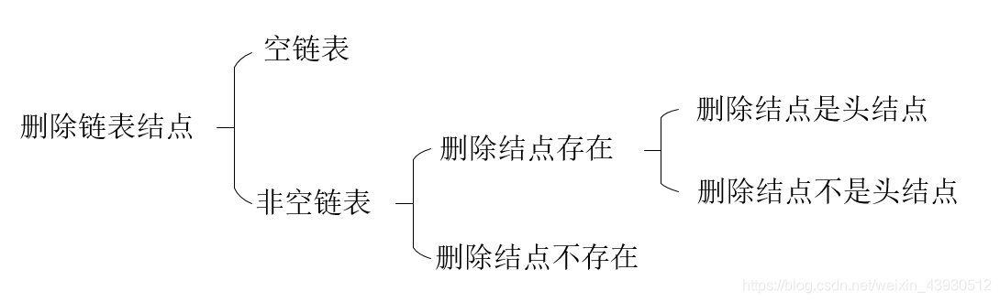

链表及基本操作
定义
基本操作
1. 创建单链表
2. 插入节点
3. 删除节点
4. 反转链表
5. 倒数第K个节点
6. 是否有环

常见数组结构与算法

## 定义

链表：由一系列结点（链表中每一个元素称为结点）组成，每个结点包括两个部分：一个是存储数据元素的数据域，另一个是存储下一个结点地址的指针域。


```cpp
 
};
```


## 基本操作

### 创建单链表

后面的操作均在其基础上进行修改
步骤：

1. 创建头节点head，并且将当前结点p指向头结点（p=head）

2. 创建下一个结点q，当前结点p的下一结点为q（p->next=q）
3. 结点p后移一位（p = p->next）

```cpp
#include <iostream>
#include<vector>

using namespace std;

struct ListNode{
	int val;
	struct ListNode* next;
	ListNode(int x) :
		val(x), next(NULL){
	}
};

int main(){
	int num;
	cin >> num;
	ListNode* head = new ListNode(num);
	ListNode* p = head;

	//利用尾插法创建一个链表
	while (cin >> num){
		ListNode* q = new ListNode(num);
		p->next = q; 
		p = p->next;
	}
	//遍历这个链表，并输出每个结点的元素
	ListNode* m = head;
	while (m != nullptr){
		cout << m->val << endl;
		m = m->next;
	}
	return 0;
}
```


### 插入节点

1. 判断原链表是否是空链表，如果是，将head指向新增结点
2. 如果不是空链表，向链表尾部插入新结点

```cpp
ListNode* insertNode(ListNode* head, int data){
	ListNode* newNode = new ListNode(data);
	ListNode* p = head;
	if (p == nullptr){
		head = newNode;
	}
	else{
		while (p->next != nullptr){
			p = p->next;
		}
		p->next = newNode;
	}
	return head;
}
```


### 删除节点



```cpp
ListNode* deleteNode(ListNode* head, int data){
	ListNode* p = head;
	//首先判断是不是空链表
	if (p == nullptr){
		return head;
	}
	else{
		//判断是不是删除头节点
		if (p->val == data){
			head = p->next;
			delete p;
			return head;
		}
		else{
			//如果有该结点，遍历到待删除节点的前一节点
			while (p->next != nullptr && p->next->val != data){
				p = p->next;
			}
			//遍历完整个链表都没有待删除节点
			if (p->next == nullptr){
				return head;
			}
			else{
				ListNode* deleteNode = p->next;
				p->next = deleteNode->next;
				delete deleteNode;
				return head;
			}
		}
	}
}
```

### 反转链表


如上图，假设在I开始反转，那么需要知道i前面的h,还要保留i后面的j,防止链表断裂
假设pNode是当前的节点，pPrev是pNode前面的节点，PNext是PNode后面的节点，那么：
当pNode不为nullptr，且pNext不为nullptr的时候：

1. 将pNode指向pPrev（pNode->next = pPrev）
2. 将pNode给pPrev（pPrev= pNode）
3. 将pNext给pNode（pNode = pNext）

当pNode不为nullptr，且pNext==nullptr的时候，把反转后的头部指向pNode

注意:判断边界条件

```cpp
#include <iostream>
#include<vector>

using namespace std;

struct ListNode{
	int val;
	struct ListNode* next;
	ListNode(int x) :
		val(x), next(NULL){
	}
};

//反转链表
ListNode* reverse(ListNode* head){
	ListNode* pPrev = nullptr;
	ListNode* p = head;
	ListNode* pReverseHead = nullptr;
	while (p != nullptr){
		ListNode* pNext = p->next;
		if (pNext == nullptr){
			pReverseHead = p;
		}
		p->next = pPrev;
		pPrev = p;
		p = pNext;
	}
	return pReverseHead;
}

int main(){
	int num;
	cin >> num;
	ListNode* head = new ListNode(num);
	ListNode* p = head;
	while (cin >> num){
		ListNode* q = new ListNode(num);
		p->next = q;
		p = p->next;
	}
	p->next = nullptr;


	ListNode* result = reverse(head);
	ListNode* node = result;

	while (node != nullptr){
		cout << node->val << endl;
		node = node->next;
	}

	return 0;

}

```

### 倒数第K个节点

思想：设置快慢指针，快指针比慢指针多走k-1步，那么快指针走到终点的时候，慢指针指向倒数第K个结点
注意K与链表节点个数的关系

```cpp
ListNode* FindKthToTail(ListNode* pListHead, unsigned int k) {
	if (pListHead == nullptr || k == 0){
		return nullptr;
	}

	ListNode* pAhead = pListHead;

	//判断K是不是超出了链表的长度
	for (int i = 0; i< k - 1; i++){
		if (pAhead->next != nullptr){
			pAhead = pAhead->next;
		}
		else{
			return nullptr;
		}
	}

	ListNode* pBehind = pListHead;
	while (pAhead->next != nullptr){
		pAhead = pAhead->next;
		pBehind = pBehind->next;
	}

	return pBehind;

}

```


### 是否有环

判断链表是否有环，如果有，找出环的入口节点


1.判断链表是否有环
	思想：可以设置快慢指针，快指针一次走两步，慢指针一次走一步，如果快指针追上了走的慢的指针，那么链表有环，如果走到了链表尾部都没有追上，说明链表无环。
	注意：快指针与慢指针是否为nullptr的判断
2.如果有环，返回入口节点
	思想：返回的节点一定在环内，如果计算出环中节点的个数count,快指针比慢指针多走count步，那么两个指针相遇时，就是环的入口节点（参考上图）

```cpp
//判断快慢指针是否相遇
ListNode* MeetNode(ListNode* pHead){
    ListNode* pNode = pHead;
    //判断链表是否为空
    if(pNode == nullptr){
        return nullptr;
    }
    
    //设置慢指针（慢指针不能为nullptr）
    ListNode* slowNode = pNode -> next;
    if(slowNode == nullptr){
        return nullptr;
    }
    
	//设置快指针
    ListNode* fastNode = slowNode -> next;
    while(fastNode != nullptr && slowNode != nullptr){
    	//相遇返回快/慢指针
        if(fastNode == slowNode){
            return fastNode;
        }
        
        //slow走一步
        slowNode = slowNode ->next;
        //fast走两步（走下一步需要判读是不是为nullptr）
        fastNode = fastNode -> next;
        if (fastNode -> next != nullptr){
            fastNode = fastNode -> next;
        }
    }
    return nullptr;
}

//计算环中节点的个数
int Count(ListNode* pMeet){
    int count = 0;
    ListNode* pNode = pMeet;
    while(pNode->next != pMeet){
        ++count;
        pNode = pNode -> next;
    }
    ++ count;
    return count;
}

//计算环的入口节点
ListNode* EntryNodeOfLoop(ListNode* pHead)
{
    ListNode* meetNode = MeetNode(pHead);
    if (meetNode == nullptr){
        return nullptr;
    }
    
    int count = Count(meetNode);
    
    ListNode* aheadNode = pHead;
    ListNode* behindNode = pHead;
    
    for(int i = 0; i< count; i++){
        aheadNode = aheadNode ->next;
    }
   
    while(aheadNode != behindNode){
        aheadNode = aheadNode -> next;
        behindNode = behindNode -> next;
    }
    
    ListNode* result = aheadNode;
    return result;
}

```

